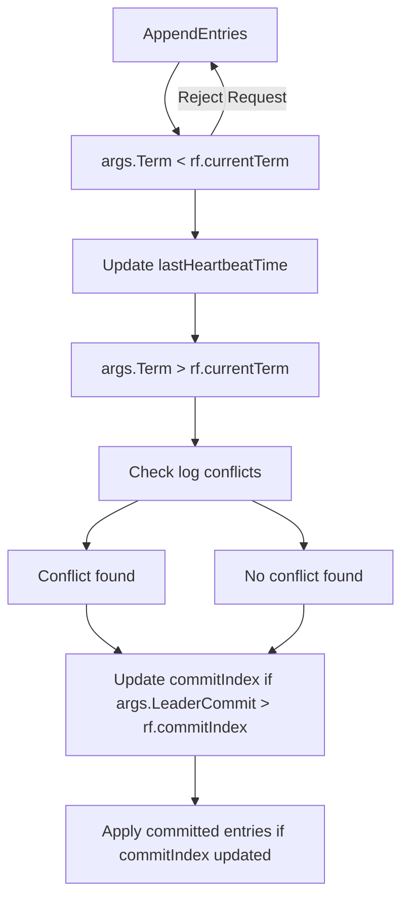

## Part 2B 日志

[TOC]

实现领导者和跟随者代码以添加新的日志条目，使得 go test -run 2B 测试通过。

1. 运行 git pull 以获取最新的实验软件。 

2. 首先，你的目标应该是通过 TestBasicAgree2B()。首先实现 Start()，然后编写代码通过 AppendEntries RPCs 发送和接收新的日志条目，遵循图 2。在每个节点上将每个新提交的条目发送到 applyCh。 
3. 你需要实现选举限制（论文第 5.4.1 节）。 
4. 在实验 2B 的早期测试中，一个可能导致无法达成一致的方法是在领导者仍然活着的情况下反复进行选举。检查选举定时器管理中的错误，或者在赢得选举后不立即发送心跳。 
5. 你的代码可能有循环不断地检查特定事件。不要让这些循环在不暂停的情况下连续执行，因为这会降低你的实现速度，导致测试失败。使用 Go 的条件变量，或者在每次循环迭代中插入 time.Sleep(10 * time.Millisecond)。 
6. 为了方便未来的实验，编写（或重写）干净、清晰的代码。有关如何开发和调试代码的提示，请重新访问我们的指导页面。
7. 如果你未能通过测试，请查看 config.go 和 test_test.go 中的测试代码，以便更好地了解测试的内容。config.go 还说明了测试者如何使用 Raft API。 即将到来的实验测试可能会因为你的代码运行太慢而失败。你可以使用 time 命令检查你的解决方案使用了多少实际时间和 CPU 时间。以下是典型的输出：

### ==关于论文中提到不要提交之前任期的日志==，可以通过在 在更新commitIndex的时候实现

```go
func (rf *Raft) updateCommitIndex() {
	rf.mu.Lock()
	defer rf.mu.Unlock()
	// 对 matchIndex 进行快速排序
	sortedMatchIndex := make([]int, len(rf.matchIndex))
	copy(sortedMatchIndex, rf.matchIndex)
	sort.Ints(sortedMatchIndex)

	// 找到中间位置的索引值
	midIndex := (len(sortedMatchIndex) - 1) / 2
	majorityMatchIndex := sortedMatchIndex[midIndex]

	// 如果 majorityMatchIndex 大于 commitIndex 并且对应的日志条目的 term 与 currentTerm 相等，则更新 commitIndex
	if majorityMatchIndex > rf.commitIndex && rf.logs[majorityMatchIndex].Term == rf.currentTerm {
		rf.commitIndex = majorityMatchIndex
	}
}
```

(输出内容)

* "ok 6.5840/raft 35.557s" 表示 Go 测量的 2B 测试所用的实际（挂钟）时间为 35.557 秒。

* "user 0m2.556s" 表示代码消耗了 2.556 秒的 CPU 时间，或者实际执行指令所花费的时间（而不是等待或睡眠）。如果你的解决方案在 2B 测试中使用了超过一分钟的实际时间，或者使用了超过 5 秒的 CPU 时间，你可能会在后面遇到麻烦。查找花费在睡眠或等待 RPC 超时、在没有睡眠或等待条件或通道消息的情况下运行的循环，或者发送大量 RPC 的时间。


### 关于安全性

事实上，选举的限制，保证了领导者的日志是最大的，而其他跟随者的日志小于领导者，同时每个跟随者的提交又是小于日志，这样就保证了所以跟随者的已提交一定是小于领导者者日志的。

同时另一个可能是旧领导者可能又会恢复，旧领导者的日志是可能大于现在的领导者，但是它的已提交一定小于现在的领导者的日志，或者说旧领导者大于现在领导者的日志一定还没有同步到大多数服务器上，不然新领导者无法选上。

==通过选举限制和日志的提交机制保证了每台服务器保证了==Leader Completeness

###  AppendEntry RPC



### 选举限制日志更新的标准

Raft通过比较日志中最后一个条目的索引和任期来确定哪个日志更新。

1. 如果日志具有不同任期的最后条目，则具有较晚任期的日志更为更新。
2. 如果日志以相同的任期结束，则较长的日志更为更新。 


### 模块化后锁的设计


我对于锁的设计是这样的，即

==进入每个函数时默认是没有持锁的==

做到需要两点

1. 每个函数如果需要使用共享数据，则需要加锁
2. 如果在函数中使用函数，则应该保证使用函数时是没有锁的

比如在`ticker`的设计中

```go
func (rf *Raft) ticker() {
	for rf.killed() == false {
		rf.mu.Lock()
		if !rf.isLeader {
			rf.mu.Unlock()
			rf.raftElection() // check if need to start a new election
		} else {
			rf.mu.Unlock()
			rf.heartBeat() // send heartbeats to followers
		}
		rf.updateCommitIndex()     //更新commitIndex
		rf.applyCommittedEntries() //应用commitIndex
		time.Sleep(time.Duration(HeartbeatInterval))
	}
}
```


## chatGPT


* 加上哑日志条目似乎可以比较好处理appendRPC，比如在在appendentries中if args.PrevLogIndex > rf.loglen() || rf.logs[args.PrevLogIndex].Term != args.PrevLogTerm { 	// If the log does not contain an entry at prevLogIndex whose term matches prevLogTerm, 	// then the server will reject the request. 	reply.Success = false 	reply.Term = rf.currentTerm } ,因为所有服务器的哑条目都是一样，当PrevLogIndex一直减小，直到0的时候，必然可以处理添加条目，而不会出现无限减少的情况?

是的，你的理解是正确的。加入哑日志条目确实简化了处理 AppendEntries RPC 的过程。哑日志条目有以下几个好处：

1. 确保所有服务器的日志在初始化时具有相同的结构，从而简化了代码的实现和调试。
2. 对于 PrevLogIndex 的边界条件处理更加简单，因为它不会无限减小，当 PrevLogIndex 减少到 0 时，所有服务器都会有一个相同的哑条目。
3. 在处理日志冲突时，哑日志条目有助于避免特殊情况。因为所有服务器都有相同的哑日志条目，所以 PrevLogIndex 和 PrevLogTerm 可以更容易地找到一个共同点。

总之，加入哑日志条目可以使 Raft 实现更加健壮和简单。

---


* rf.nextIndex 的含义到底是什么，为什么需要初始化为lastLogIndex + 1?

`rf.nextIndex` 是一个数组，其中的每个元素对应 Raft 集群中的一个服务器。对于领导者来说，`rf.nextIndex[i]` 表示下一个要发送给服务器 `i` 的日志条目的索引。简单来说，`nextIndex` 用于追踪领导者已发送给每个跟随者的日志条目的进度。

当一个新的领导者当选后，它需要将其日志同步到所有跟随者。

==在这个过程开始时，领导者可能还不知道跟随者的日志状态。因此，领导者将假设所有跟随者的日志与自己的日志一致，并试图从自己的最新日志条目开始发送新条目==。

这就是为什么 `rf.nextIndex` 需要初始化为 `lastLogIndex + 1` 的原因。

初始化为 `lastLogIndex + 1` 的含义是，如果领导者有新的日志条目需要发送，它将从当前日志的末尾开始。然后，如果在发送过程中发现跟随者的日志与领导者的日志不匹配，领导者会逐步减小 `nextIndex` 的值，尝试找到跟随者日志中最后一个匹配的条目，然后从该点开始重新发送日志条目。

通过 `nextIndex`，领导者可以跟踪与每个跟随者的日志同步进度，并在必要时进行调整，以确保所有服务器的日志最终达到一致状态。

---

*  我突然意识到""每次将新条目提交到日志时，每个 Raft 节点 应该向服务（或测试器）发送一个 ApplyMsg。""  这样做，其实是把applyCh当成状态机，当某个日志条目被提交的时候，就发送该日志条目到这个channel，其实也就是于应用到状态机上?

是的，您的理解是正确的。`applyCh` 是一个通道，用于将新提交的日志条目发送给状态机。当一个日志条目在多数服务器上被提交并达	成一致时，领导者会将该日志条目应用到状态机上，然后通过 `applyCh` 将提交的日志条目通知给其他 Raft 服务器。

在实际的应用场景中，状态机可能是一个分布式的键值存储、数据库或其他类型的服务。使用 `applyCh` 可以确保当日志条目被提交时，所有服务器都知道需要将这些日志条目应用到其本地状态机上。这样，Raft 集群中的所有服务器都可以保持状态机的一致性。


---

*  我需要在raft结构体添加这个applych嘛，另外我如何初始化和更新leader's commitIndex？定时地遍历所有的matchIndex嘛？

是的，您需要在 Raft 结构体中添加 `applyCh`，这样 Raft 实例才能使用它。通常，您需要在 `Make()` 函数中将 `applyCh` 作为参数传入，并在创建 Raft 结构体时将其存储起来。

关于初始化和更新 leader 的 `commitIndex`，您可以采用以下策略：

1. 当选举成功后，新 leader 将其 `commitIndex` 初始化为 0 或其最后一个日志条目的索引。同时，`nextIndex` 数组中的每个元素初始化为 leader 最后日志条目索引 + 1。
2. leader 会定期发送心跳信息和日志条目复制请求（`AppendEntries` RPC）。在这些请求中，leader 会尝试更新其 `matchIndex` 数组，即每个 follower 已知的已复制日志条目的最大索引。
3. 当收到来自 follower 的 `AppendEntries` 响应时，leader 更新其 `matchIndex` 数组，并检查是否有新的日志条目可以被提交。要提交一个日志条目，需要满足两个条件：
   - 这个条目在 leader 和大多数 followers 的日志中都存在。
   - 这个条目的任期与 leader 的当前任期相同。
4. 如果满足上述条件，leader 更新其 `commitIndex` 并将更新后的 `commitIndex` 发送给所有 followers。
5. 一旦 `commitIndex` 发生变化，leader 和 followers 都需要将新提交的日志条目应用到状态机上，并通过 `applyCh` 发送一条 `ApplyMsg`。

通常，您可以在 leader 的主循环中定期检查和更新 `commitIndex`。在收到 `AppendEntries` 响应时，您还需要更新相应 follower 的 `matchIndex`。


---

* 在每次在 leader 的主循环中定期检查和更新 commitIndex，我可以这样先检查matchIndex中大于commitIndex+1的日志是否已经超过半数，再逐渐增加。不过这样复杂度是不是高了点？另外是否需要添加一个字段来标记peers的状态，如果超过一定次数调用RPC失败就认为断开联系?

  

1. 更新 `commitIndex` 的方法： 您提出的更新 `commitIndex` 的方法是可行的。您可以检查 `matchIndex` 中大于 `commitIndex + 1` 的日志是否已经超过半数，然后逐渐增加。尽管这样的实现可能存在一定的复杂度，但它可以确保日志的一致性和正确性。您可以尝试对这个过程进行优化，例如对 `matchIndex` 数组进行排序，以便更快地找到满足要求的索引值。
2. 标记 peer 状态的字段： 添加一个字段来标记 peer 的状态是个好主意，这样可以帮助您跟踪各个 follower 的连接状态。在尝试向 follower 发送 RPC 请求时，您可以根据其状态决定是否继续尝试。如果 RPC 请求连续失败超过一定次数，您可以将该 follower 标记为断开连接。当然，也需要有一个机制来重置这个状态，以便在 follower 恢复连接时，可以重新加入集群并与 leader 同步。

这些策略将有助于提高 Raft 系统的健壮性和容错能力。请注意，各种实现策略可能会对性能产生影响。在实现这些策略时，您需要权衡性能与正确性。

---

* 对，可以先排序，我只要比较matchIndex[中间位置-1]和commitIndex,这样看起来可以在 leader 的主循环中定期对matchIndex进行快速排序，写个版本出来?

```go
func (rf *Raft) updateCommitIndex() {
	rf.mu.Lock()
	defer rf.mu.Unlock()

	if !rf.isLeader {
		return
	}

	// 对 matchIndex 进行快速排序
	sortedMatchIndex := make([]int, len(rf.matchIndex))
	copy(sortedMatchIndex, rf.matchIndex)
	sort.Ints(sortedMatchIndex)

	// 找到中间位置的索引值
	midIndex := (len(sortedMatchIndex) - 1) / 2
	majorityMatchIndex := sortedMatchIndex[midIndex]

	// 如果 majorityMatchIndex 大于 commitIndex 并且对应的日志条目的 term 与 currentTerm 相等，则更新 commitIndex
	if majorityMatchIndex > rf.commitIndex && rf.logs[majorityMatchIndex].Term == rf.currentTerm {
		rf.commitIndex = majorityMatchIndex
	}
}

```

---

*  我对go还不熟悉，解释// 对 matchIndex 进行快速排序 sortedMatchIndex := make([]int, len(rf.matchIndex)) copy(sortedMatchIndex, rf.matchIndex) sort.Ints(sortedMatchIndex)，另外rf.logs[majorityMatchIndex].Term == rf.currentTerm是为了保证不提交之前任期的日志对吧?

这段代码的目的是创建一个新的整数切片 `sortedMatchIndex`，其中包含与 `rf.matchIndex` 相同的元素，然后对这个新切片进行排序。这样，我们可以在排序后的切片中找到半数以上的服务器的匹配日志索引。

以下是这段代码的逐行解释：

1. `sortedMatchIndex := make([]int, len(rf.matchIndex))` - 创建一个与 `rf.matchIndex` 具有相同长度的新整数切片 `sortedMatchIndex`。
2. `copy(sortedMatchIndex, rf.matchIndex)` - 将 `rf.matchIndex` 的元素复制到新创建的 `sortedMatchIndex` 中。这样我们就有了一个包含相同元素的新切片，可以对其进行排序而不影响原始 `matchIndex`。
3. `sort.Ints(sortedMatchIndex)` - 对 `sortedMatchIndex` 切片中的整数进行排序（升序）。

关于 `rf.logs[majorityMatchIndex].Term == rf.currentTerm` 这个条件，您是对的。这个条件是为了确保不会提交之前任期的日志。在更新 `commitIndex` 之前，我们要检查大多数节点已复制的日志条目的任期是否与当前领导者的任期相等。这样可以防止在网络分区或其他异常情况下提交过时的日志条目。

---

* 这是发送appendentries RPC的函数，你看看是否有什么问题？

你的代码实现看起来是合理的，但是我有一些建议来优化这个实现：

1. 在 `sendAppendEntries` 函数中，为了防止无限重试发送 AppendEntries 请求，建议添加一个重试次数限制。这样，当 AppendEntries 请求连续失败时，循环将终止。

```go
goCopy code
const maxRetries = 3
retryCount := 0

for {
    // ...
    if ok {
        if rf.processAppendEntriesReply(reply, server) {
            break
        }
    } else {
        retryCount++
        if retryCount >= maxRetries {
            break
        }
    }
}
```

1. 在 `processAppendEntriesReply` 函数中，如果 follower 的日志已经与 leader 的日志保持一致，你应该更新 `nextIndex[server]` 和 `matchIndex[server]` 的值。你可以这样做：

```go
goCopy code
if reply.Success {
    rf.nextIndex[server] = reply.LastLogIndex + 1
    rf.matchIndex[server] = reply.LastLogIndex
    return true
} else {
    // ...
}
```

请注意，为了实现这个更改，你需要在 `AppendEntriesReply` 结构体中添加一个新字段 `LastLogIndex`，并在 `AppendEntries` 函数中设置它的值。这将让 leader 知道 follower 的日志已经成功更新到哪个索引。

除了这些建议外，你的代码看起来是合理的，可以处理发送和处理 AppendEntries RPC 的基本逻辑。

---

* 也就是这样的处理是问题的rf.nextIndex[server] = rf.loglen() + 1，因为可能发送心跳的时候，领导者的日志已经在被更新了，你的提醒很有效

是的，你的理解是正确的。使用 `rf.nextIndex[server] = rf.loglen() + 1` 可能会导致问题，因为在发送心跳的过程中，领导者的日志可能已经发生了更新。通过在 `AppendEntriesReply` 结构体中添加一个 `LastLogIndex` 字段，并在处理响应时使用该字段来更新 `nextIndex[server]` 和 `matchIndex[server]`，可以确保领导者始终了解跟随者的日志状态，并能够正确地处理日志更新。

这是一个很好的改进，它将使你的 Raft 实现更加健壮和准确。请确保在处理 AppendEntries RPC 响应时考虑到这一点。

---

* 在以上我的raft代码中，有哪些地方可能会需要出现“你的代码可能有循环不断地检查特定事件。不要让这些循环在不暂停的情况下连续执行，因为这会降低你的实现速度，导致测试失败。使用 Go 的条件变量?

在你的代码中，可能需要使用条件变量的地方是：

1. Follower 等待成为 Candidate 或 Leader。在这种情况下，你可以使用条件变量等待某个事件，例如超时或收到心跳，然后重新评估节点的状态。
2. Leader 在等待 AppendEntries RPC 的响应。在这种情况下，你可以使用条件变量等待 AppendEntries RPC 响应，并在收到回复时唤醒等待的线程。
3. 应用已提交的日志条目。你可以使用条件变量等待日志提交，然后唤醒等待的线程来应用已提交的日志条目。

要在 Go 中使用条件变量，你需要使用 `sync.Cond` 类型。例如：

```go
goCopy code
type Raft struct {
    ...
    cond *sync.Cond
    ...
}

func (rf *Raft) someFunc() {
    rf.mu.Lock()
    defer rf.mu.Unlock()

    for !someCondition {
        rf.cond.Wait()
    }
    // Perform some action
}

func (rf *Raft) anotherFunc() {
    rf.mu.Lock()
    defer rf.mu.Unlock()

    // Perform some action that changes the condition
    rf.cond.Broadcast()
}
```

在这个示例中，`someFunc` 等待某个条件成立，而 `anotherFunc` 更改了使条件成立的状态并唤醒等待中的线程。

----
