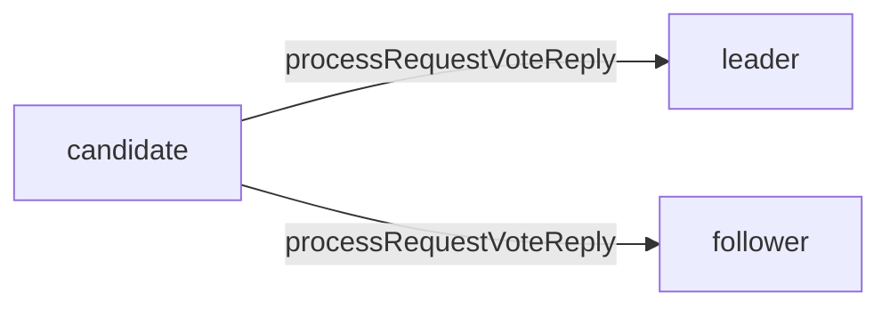
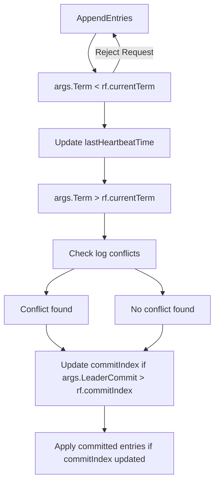

[TOC]

现在让我摆脱gpt的魔咒，来重新梳理Lab2


## 状态


在raft服务器有三种状态

1. 领导者(`raft`字段`isLeader`来表示)
2. 候选者(`raft`字段`votedFor`=`me`的时候)
3. 跟随者，其他

### 状态和RPC

在写下面的RPC的时候，考虑清楚

1. 

`sendRequestVote`的是候选者，在做`processRequestVoteReply` 首先需要判断server 是不是依然是

candidate

* 因为可能已经选举成功
* 或者发现了新的领导者（**接收到心跳**）或者其他的`processRequestVoteReply` 发现了更高任期




2. 

`sendAppendEntries`的是领导者，


3. `AppendEntries`

   * 候选者

     ```mermaid
     graph LR
     candidate-->follower
     ```

     

   * 领导者(被更高的任期变成呢跟随者)

      ```mermaid
      graph LR
      leader-->follower
      ```

     

   * 跟随者

     

   


## RequestVote RPC


## AppendEntry RPC

AppendEntry RPC



###


## 哑条目

因为加上了哑条目，所以最小的nextIndex是1


## 测试

`nCommitted(index int)`函数是用来检测某个index的log是否被提交

`one`函数

这个函数是一个Go语言编写的方法，它尝试在一组分布式服务器中提交一个命令，并确保预期数量的服务器达成一致。这个函数可能在一个实现了Raft共识算法的分布式系统中使用。函数接收三个参数：要提交的命令（`cmd`），期望达成一致的服务器数量（`expectedServers`）以及是否在失败后重试（`retry`）。

函数的基本工作流程如下：

1. 计算超时时间，以便在尝试了一定时间后放弃提交命令。
2. 在没有达到超时时间且当前测试未完成的情况下，遍历所有服务器，尝试找到一个领导者。
3. 如果找到了一个领导者并成功提交了命令，就等待一段时间以确认命令已被提交并且预期数量的服务器达成一致。
4. 如果命令成功提交并达成一致，函数返回命令的索引。如果在尝试了足够多次后仍然没有成功，函数将报告错误并返回-1。

这个函数的主要目的是在分布式系统中测试Raft共识算法的实现，确保服务器能够就特定的命令达成一致。需要注意的是，这个函数的实现依赖于在`config`结构体中预先设置的服务器配


## 问题


### 为什么 HeartbeatInterval 设得过于小，反而会出现一些时间没有领导者的情况？

在`ticker`中，我是这样设置的

```go
func (rf *Raft) ticker() {
	for rf.killed() == false {
		rf.mu.Lock()
		if !rf.isLeader {
			rf.mu.Unlock()
			rf.raftElection() // check if need to start a new election
		} else {
			rf.mu.Unlock()
			rf.heartBeat() // send heartbeats to followers
		}
		rf.updateCommitIndex()     //更新commitIndex
		rf.applyCommittedEntries() //应用commitIndex
		time.Sleep(time.Duration(HeartbeatInterval))
	}
}

```

==注意，在我的ticker中，领导者和跟随者的HeartbeatInterval是相同的==

### 需要考虑节点失效


