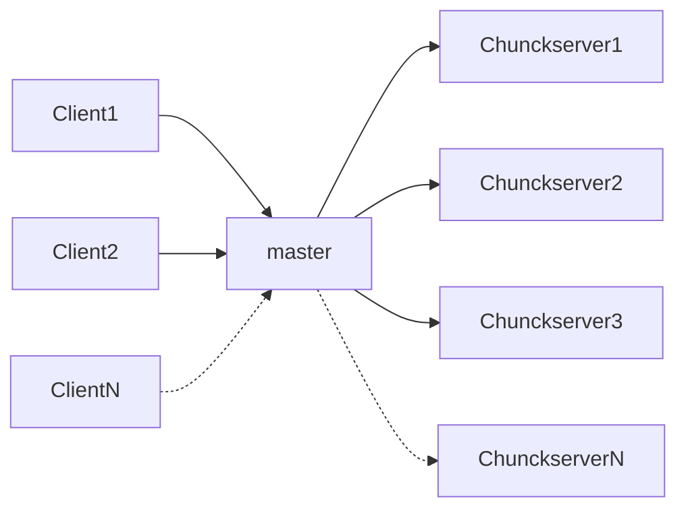
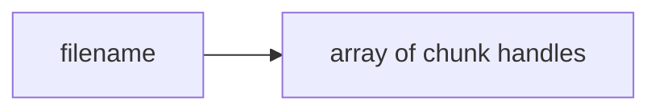
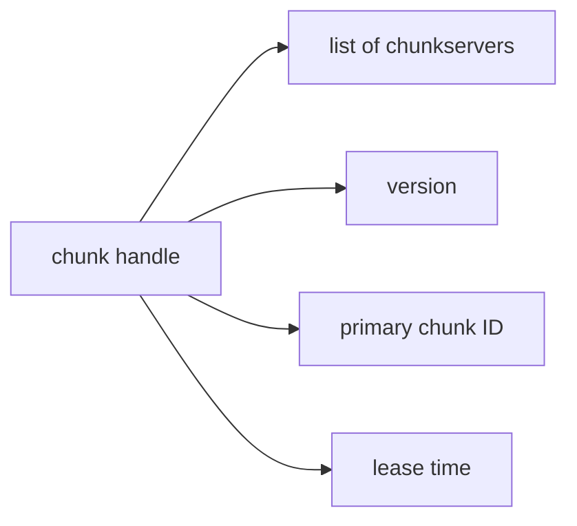
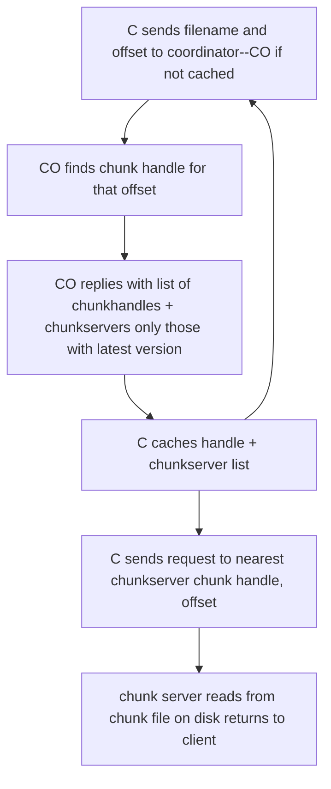

# Lecture 3: GFS(需要重读)

[TOC]

## 分布式储存的难点

### Why are we reading this paper GFS ?

首先**distributed storage is a key abstraction**，构建分布式系统主要就是关于设计存储系统。GFS将解答

1. what should the interface/semantics look like?
2.  how should it work internally?

GFS paper touches on many themes of 6.824   

* parallel performance,
* fault tolerance
* replication
* consistency

这是一篇good systems paper ，涉及details from apps all the way to network,是successful real-world design，影响了Hadoop's HDFS(HDFS 是一种分布式文件系统，用于处理在商业硬件上运行的大型数据集)

### Why is distributed storage hard?

分布式系统的出发点和多核运算的出发点类似，==而分布式储存的难点和多核运算时共享数据的难点类似==。

* high performance -> shard data over many servers

  为了追求高性能，多台计算机分布式地运行，需要将数据分片(shard)部署到大量不同的服务器上

* many servers -> constant faults

  一旦分片服务器的数量上去了，就会出现常态化的故障。

* fault tolerance -> replication

  因此需要提供一种容错机制

  * 最简单的方式就是复制，即维护2～3个数据的副本，一旦其中一个出了故障，就使用另外一个。

* replication -> potential inconsistencies

  复制会滋生新的问题，就是如果使用不当，两个副本之间的数据出现不一致，此时实质意义上他们就不互为副本

* better consistency -> low performance

  为了保证更好的一致性，需要不同服务器间进行额外的网络交互，这就意味着性能的下降。

## Bad design

### What would we like for consistency?

* Ideal model: same behavior as a single server

从客户端看来，一个理想分布式模型应该像一个服务器。

#### A single server model

我们使用一个单线程的服务器模型

1. ideal server executes client operations one at a time even if multiple clients issued operations concurrently  reads reflect previous writes
   多个客户端会并发地发送请求到服务器上，但服务器同一个时间只会处理一个请求

2. Even if server crashes and restarts,all clients see the same data

   即使服务器crash或者重启，所有客户端都读到相同的数据

    现在假定一个场景，suppose C1 and C2 write concurrently, and after the writes have completed, C3 and C4 read. what can they see?

* C1: 写X为1
* C2: 写X为2 
* C3: 读X?
* C4:        读X?
   answer: either 1 or 2, but both have to see the same value.

我们并不能确定服务器先处理C1和C2的哪个请求，所以C3和C4既可能读到1也可能读到2，但数值一定相同。不过 single server一旦发生故障，比如磁盘损坏，则整个系统就不可用了，所以

1.  This is a "strong" consistency model.
2. a single server has poor fault-tolerance

#### Bad design

现在考虑一个很糟糕的设计，在S1和S2两台服务器上存储一样的key-value表单

a simple but broken replication scheme:two replica servers, S1 and S2

1. clients send writes to both, in parallel

   考虑到一致性，来自用户的写请求需要在S1和S2两台服务器上执行

2. clients send reads to either

   为了解决single server model的poor fault-tolerance问题，读请求只需要在一台服务器上执行

再使用之前的场景

* C1: 写X为1
* C2: 写X为2 
* C3: 读X?
* C4:        读X?

**这时候就strong consistency就无法得到保证**

1. C1's and C2's write messages could arrive in
       different orders at the two replicas.
       if C3 reads S1, it might see x=1
       if C4 reads S2, it might see x=2

   无法保证两台服务器以同样的顺序处理C1和C2的请求，以上的例子中S1后执行C1,S2后执行C2

2. What if S1 receives a write, but  the client crashes before sending the write to S2?

   更糟糕的情况是，按照客户端写请求的策略，在两次写请求之间客户端crash了。

如何解决在这个模型中一致性的问题？

==Better consistency usually requires communication to ensure the replicas stay in sync==

但这就会导致系统速度的减慢， 接下来就是==tradeoffs== possible between performance and consistency

## GFS 设计目标

### Context

背景起源于 Many Google services (Mapreduce, crawler, indexer, log storage/analysis)

1. Google有大量数据，需要大量磁盘来储存(**big**)
2. MapReduc这样的工具可以快速地处理这些数据(**fast**)
3. 不同的应用都可以查看这些数据，shared among multiple applications e.g. crawl, index, analyze (**unified**)

所以Google需要**big fast unified** file system,这就诞生了GFS.

为了解决big和fast的问题，通过automatic "sharding" of each file over many servers/disks，同一个文件切割被放到多个服务器上。

1. For parallel performance with many clients MapReduce,客户端可以从多个服务器上读取同一个文件，这样就可以获得更大的吞吐量。
2. For huge files too big for one server，巨大的文件对于一个服务器来说过于庞大。

考虑到容错性， GFS还可以做到一定程度的automatic recovery from failures

GFS还有些特性

* Just one data center per deployment，只有一个数据中心
* Just Google applications/users 只Google内部使用
* Aimed at sequential access to huge files; read or append，GFS只会顺序处理，不支持随机访问，它是一个针对TB级别文件诞生的分布式文件系统
      I.e. not a low-latency DB for small items

### What was new about this in 2003?

 How did they get an SOSP paper accepted?

Not the basic ideas of distribution, sharding, fault-tolerance.

1. Huge scale.

2. Used in industry, real-world experience

3. **Successful use of weak consistency**.这意味着GFS并不一定能返回给应用程序正确的答案

   同时GFS宣传单个Master节点就能很好地工作

## GFS Overall structure

GFS结构如下，分别是大量的客户端-->一个master节点-->chunkserver

一个大文件big files split into 64 MB chunks,被分布式地放置在lots of chunkservers

(需要注意==each chunk replicated on 3 chunkservers==why 3 rather than 2?）

1. master节点作为coordinator tracks file names，**管理文件和chunk的映射信息**，master知道一个文件的所有chunk ID，也知道每块chunk在哪个chunkserver

   （**我想这里有两点**）

   1. 从chunk ID到确定chunkserver应该需要一个==哈希函数==（看了后面的设计实际要复杂）
   2. ==master和Unix中FS中inode的设计有异曲同工之妙== why?

2. 每个chunkserver上都store若干64MB 大小的chunk，==实际储存文件数据==

   

### Coordinator state

现在来看Master Data

第一个表单是文件名和chunk handle(chunk ID) 数组的对应

第二个表单是chunk handle(chunk  ID)和chunk相关数据的对应，数据有

* **list of chunkservers (v)** : 记录了该chunk储存在哪些服务器上
* **version(nv)**  : 该chunk当前的版本号
* **primary(v)** : 同一个chunk会多个拷贝，其中有一个是主chunk(primary chunk),所以master还会保存主chunk 的ID
* **lease time(v)** :  主chunk并不是一成不变的，会在lease time过期 (之后就需要改变)。

上述两个表单都存储在内存中，但为了master故障后可以重启，所以需要将一些数据写进disk,需要放进disk的有以下的数据

1. filename-->array of chunk handles
2. chunk handle-->version(==版本为什么需要保存呢？==)

*如果说为了能逐步恢复master，是想后进先出地从log恢复master节点，直接使用栈组织checkpoint就好了吧*

更具体来说，文件增加了chunk或者chunk因为主chunk到期更新版本的时候，master会也需要想在磁盘的log中追加记录，生成一个checkpoint。

现在考虑为什么其他数据不需要储存在disk里

* list of chunkservers : 这点我想是分布式最大的特点。master的disk里可以不保存知道chunk在哪个chunkserver里，因为master一旦crash and reboot，它可以和chunkserver通信查询每个chunkserver存储了哪些chunk。**我想每个chunkserver也需要维护一个chunk handle list**
* primary chunk  ID and lease time : reboot之后直接选取一个新的主chunk

## GFS read file

What are the steps when client C wants to read a file?

  1. C sends **文件名**和**offset** to coordinator (CO) (if not cached)

  2. CO finds **chunk handle** for that **offset**

  3. CO replies with list of chunkhandle + chunkservers only those with latest version

     同一个chunk handle会有多个副本，因此chunkserver是一个list

  4. C caches **handle + chunkserver list**

  5. C sends request to nearest chunkserver  with **chunk handle**, **offset** (在Google的数据中心 ,IP地址是连续的，所以可以通过IP地址判断网络位置远近)

  6. chunk server reads from chunk file on disk, returns to client

Clients only ask coordinator about file names and lists of chunk handles  clients cache name -> chunkhandle info

==所以client并不会cache一整个chunk，而是cache文件名和chunk信息(chunk handle + chunkservser list)的映射数据==

coordinator does not handle data, so (hopefully) not heavily loaded,文件数据不经过master，chunk的信息本身是数据量较小。

#### 问题

1. 如果客户端请求的数据量大于chunk(64MB)或者数据跨域两个chunk？

   客户端依赖一个GFS的库，该库会分多次请求master

2. master节点会根据offset除chunk大小计算出chunk ID

How does the coordinator know what chunkservers have a given chunk?

## GFS record append

GFS写文件会更复杂，它和读文件类似，客户端都需要调用GFS的库。我们只讨论对GFS文件的追加，即将客户端中的buffer数据写进文件的最后。What are the steps when C wants to do a "record append"?

  1. C asks CO about file's last chunk

     追加文件需要知道文件的最后一个chunk在哪里

  2. CO tells C the primary and secondaries

     和读的情况不同，GFS写需要通过primary chunk写入。但这时候就需要考虑primary chunk不存在的情况。

     (**以下讨论的是,如果primary chunk不存在，那么master如何做**)。==我们记得在前面需要将chunk的版本号写进磁盘里==所以我们需要先把持有最新版本chunk的chunkserver集合，然后从中挑选出primary chunk,其他作为secondary.

       **master会更新这些chunk的版本号，然后一起发给client**

  3. C sends data to all (**just temporary...**), waits for all replies (?)

     只是发数据，从最近的网络开始

  4. C tells P to append，P会察看版本号是否匹配

  5. P check that lease hasn't expired, and chunk has space

     需要保证lease没有过期，这因为如果lease过期了，说明还有其他的primary

  6. P picks an offset (at end of chunk)

  7. P writes its own chunk file (a Linux file)

  8. P tells each secondary the offset, tells to append to chunk file

  9. P waits for all secondaries to reply, or timeout
     secondary can reply "error" e.g. out of disk space

  10. P tells C "ok" or "error"

  11. **C retries from start if error**

做的是(At least once)

如果这样做append的话，文件就会出问题

 

**可以使用checksum(检验和)来规避这一问题** ,这些可以交给GFS的库来解决

GFS guarantees to applications -- consistency (Table 1)
  somewhat complex!
  if primary tells client that a write succeeded,
    and no other client is writing the same part of the file,
    all readers will see the write.
    "defined"

  if successful concurrent writes to the same part of a file,
    and they all succeed,
    all readers will see the same content,
    but maybe it will be a mix of the writes.
    "consistent"
    E.g. C1 writes "ab", C2 writes "xy", everyone might see "axyb".

  if primary doesn't tell the client that the write succeeded,
    different readers may see different content, or none.
    "inconsistent"

## 一致性

==主要的是开始思考一致性==

master和primary保持heartbeat

How can inconsistent content arise?
  Primary P updated its own state.
  But secondary S1 did not update (failed? slow? network problem?).
  Client C1 reads from P; Client C2 reads from S1.
    they will see different results!
  Such a departure from ideal behavior is an "anomaly".
  But note that in this case the primary would have returned
    an error to the writing client.

How can consistent but undefined arise?
  Clients break big writes into multiple small writes,
  e.g. at chunk boundaries, and GFS may interleave
    them if concurrent client writes.

How can duplicated data arise?
  Clients re-try record appends.

Why are these anomalies OK?
  They only intended to support a certain subset of their own applications.
    Written with knowledge of GFS's behavior.
  Probably mostly single-writer and Record Append.
  Writers could include checksums and record IDs.
    Readers could use them to filter out junk and duplicates.
  Later commentary by Google engineers suggests that it
    might have been better to make GFS more consistent.
    http://queue.acm.org/detail.cfm?id=1594206

What might better consistency look like?
  There are many possible answers.
  Trade-off between easy-to-use for client application programmers,
    and easy-to-implement for storage system designers.
  Maybe try to mimic local disk file behavior.
  Perhaps:
    * atomic writes: either all replicas are updated, or none,
      even if failures.
        * read sees latest write.
            * all readers see the same content (assuming no writes).
      We'll see more precision later.

##  举例

Let's think about how GFS handles crashes of various entities.

A client crashes while writing?
  Either it got as far as asking primary to write, or not.

### A secondary crashes just as the primary asks it to write?

master获得了错误，会更新chunk的版本号，但C它会cache过去的版本号

    1. Primary may retry a few times, if secondary revives quickly
     with disk intact, it may execute the primary's request
     and all is well.
    2. Primary gives up, and returns an error to the client.
     Client can retry -- but why would the write work the second time around?
    3. Coordinator notices that a chunkserver is down.
     Periodically pings all chunk servers.
     Removes the failed chunkserver from all chunkhandle lists.
     Perhaps re-replicates, to maintain 3 replicas.
     Tells primary the new secondary list.（会更新版本）

Re-replication after a chunkserver failure may take a Long Time.
  Since a chunkserver failure requires re-replication of all its chunks.
  80 GB disk, 10 MB/s network -> an hour or two for full copy.
  So the primary probably re-tries for a while,
    and the coordinator lets the system operate with a missing
    chunk replica,
    before declaring the chunkserver permanently dead.
  How long to wait before re-replicating?
    Too short: wasted copying work if chunkserver comes back to life.
    Too long: more failures might destroy all copies of data.

## What if a primary crashes?
  Remove that chunkserver from all chunkhandle lists.
  For each chunk for which it was primary,
    wait for lease to expire,
    grant lease to another chunkserver holding that chunk.

What is a lease?
  Permission to act as primary for a given time (60 seconds).
  Primary promises to stop acting as primary before lease expires.
  Coordinator promises not to change primaries until after expiration.
  Separate lease per actively written chunk.

Why are leases helpful?
  The coordinator must be able to designate a new primary if the present
    primary fails.
  But the coordinator cannot distinguish "primary has failed" from
    "primary is still alive but the network has a problem."
  What if the coordinator designates a new primary while old one is active?
    two active primaries!
    C1 writes to P1, C2 reads from P2, doesn't seen C1's write!
    called "split brain" -- a disaster
  Leases help prevent split brain:
    Coordinator won't designate new primary until the current one is
    guaranteed to have stopped acting as primary.

What if the coordinator crashes?
  Two strategies.
  1. Coordinator writes critical state to its disk.
     If it crashes and reboots with disk intact,
     re-reads state, resumes operations.
  2. Coordinator sends each state update to a "backup coordinator",
     which also records it to disk; backup coordinator can take
     over if main coordinator cannot be restarted.

What information must the coordinator save to disk to recover from crashes?
  Table mapping file name -> array of chunk handles.
  Table mapping chunk handle -> current version #.
  What about the list of chunkservers for each chunk?
    A rebooted coordinator asks all the chunkservers what they store.
  A rebooted coordinator must also wait one lease time before
    designating any new primaries.

* Who/what decides the coordinator is dead, and chooses a replacement?
  Paper does not say.
  Could the coordinator replicas ping the coordinator, 
    and automatically take over if no response?
  
* Suppose the coordinator reboots, and polls chunkservers.
  What if a chunkserver has a chunk, but it wasn't a secondary?
    I.e. the current primary wasn't keeping it up to date?
  Coordinator remembers version number per chunk, on disk.
    Increments each time it designates a new primary for the chunk.
  Chunkserver also remembers its version number per chunk.
  When chunkserver reports to coordinator, coordinator compares
    version number, only accepts if current version.

* What if a client has cached a stale (wrong) primary for a chunk?

* What if the reading client has cached a stale server list for a chunk?

* What if the primary crashes before sending append to all secondaries?
  Could a secondary that *didn't* see the append be chosen as the new primary?
  Is it a problem that the other secondary *did* see the append?

What would it take to have no anomalies -- strict consistency?
  I.e. all clients see the same file content.
  Too hard to give a real answer, but here are some issues.
  * All replicas should complete each write, or none -- "atomic write".
    Perhaps tentative writes until all promise to complete it?
    Don't expose writes until all have agreed to perform them!
  * Primary should detect duplicate client write requests.
  * If primary crashes, some replicas may be missing the last few ops.
    They must sync up.
  * Clients must be prevented from reading from stale ex-secondaries.
    You'll see solutions in Labs 2 and 3!

* Are there circumstances in which GFS will break its guarantees?
  e.g. write succeeds, but subsequent readers don't see the data.
  All coordinator replicas permanently lose state (permanent disk failure).
    Read will fail.
  All chunkservers holding the chunk permanently lose disk content.
    Read will fail.
  CPU, RAM, network, or disk yields an incorrect value.
    checksum catches some cases, but not all
    Read may say "success" but yield the wrong data!
    Above errors were "fail-stop", but this is a "byzantine" failure.
  Time is not properly synchronized, so leases don't work out.
    So multiple primaries, maybe write goes to one, read to the other.
    Again, read may yield "success" but wrong data -- byzantine failure.

Performance (Figure 3)
  large aggregate throughput for read
    94 MB/sec total for 16 clients + 16 chunkservers
      or 6 MB/second per client
      is that good?
      one disk sequential throughput was about 30 MB/s
      one NIC was about 10 MB/s
    Close to saturating inter-switch link's 125 MB/sec (1 Gbit/sec)
    So: multi-client scalability is good
    Table 3 reports 500 MB/sec for production GFS, which was a lot
  writes to different files lower than possible maximum
    authors blame their network stack (but no detail)
  concurrent appends to single file
    limited by the server that stores last chunk
  hard to interpret after 15 years, e.g. how fast were the disks?

Retrospective interview with GFS engineer:
  http://queue.acm.org/detail.cfm?id=1594206
  file count was the biggest problem
    eventual numbers grew to 1000x those in Table 2 !
    hard to fit in coordinator RAM
    coordinator scanning of all files/chunks for GC is slow
  1000s of clients -> too much CPU load on coordinator
  coordinator fail-over initially manual, 10s of minutes, too long.
  applications had to be designed to cope with GFS semantics
    and limitations.
    more painful than expected.
  BigTable is one answer to many-small-files problem
  and Colossus apparently shards coordinator data over many coordinators

Summary
  case study of performance, fault-tolerance, consistency
    specialized for MapReduce applications
  good ideas:
    global cluster file system as universal infrastructure
    separation of naming (coordinator) from storage (chunkserver)
    sharding for parallel throughput
    huge files/chunks to reduce overheads
    primary to choose order for concurrent writes
    leases to prevent split-brain
  not so great:
    single coordinator performance
      ran out of RAM and CPU
    chunkservers not very efficient for small files
    lack of automatic fail-over to coordinator replica
    maybe consistency was too relaxed

