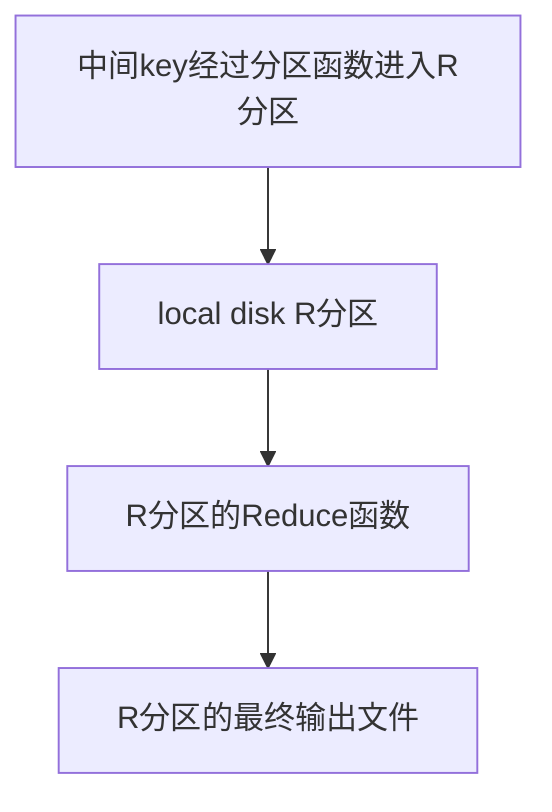

# MapReduce(翻译)

[TOC]

## 0  Abstract

MapReduce 是一种用于处理和生成大型数据集的编程模型和相关实现。 用户指定处理key/value对以生成一组中间key/vale对的 map 函数，以及合并与**同一中间key**关联的所有中间value的 reduce 函数。 如论文所示，许多现实世界的任务都可以在此模型中表达。

以这种函数式编写的程序会自动并行化(parallelized)并在大型商用机器集群上(a large cluster of commodity machines)执行。 运行时系统负责对输入数据进行分区,在一组机器上调度程序执行、处理机器故障以及管理所需的机器间通信等细节。 这使得没有任何并行和分布式系统经验的程序员可以轻松地利用大型分布式系统的资源。

我们的MapReduce 实现在大型商用机器集群上运行，并且具有高度可扩展性：典型的 MapReduce 计算在数千台机器上处理数 TB 的数据。 该系统易于使用：已经实施了数百个 MapReduce 程序，每天在 Google 的集群上执行超过一千个 MapReduce 作业。

## 1  Introduction

在过去的五年里，作者和谷歌的许多其他人进行了数百种特殊用途的计算。

我们处理大量的原始数据，例如爬取的文档、Web 请求日志等，来计算派生的数据（**derived data**）------例如inverted indices,Web 文档图形化结构的各种表示，每个主机爬取的页面数量的摘要，给定一天中被查询最频繁的data set等等。大多数此类计算在概念上都很简单(straightforward)。 然而，输入数据通常很大所以计算必须分布式地运行在成百上千台机器上才能在合理的时间内完成。 **解决并行化计算(parallelize the computation),分布数据(distribute the data) 和处理故障(handle failures) 等等问题**的复杂代码使得原本简单的计算变得困难起来。

针对这种复杂性，我们设计了一个新的抽象，它将并行化(**parallelization**)、容错(**fault-tolerance**)、数据分布(**data distribution**)和负载平衡(**load balancing**)的细节隐藏在库中，使得我们可以直接表达概念上简单的计算。我们的抽象受到 `Lisp `和许多其他函数式语言中存在的 `map` 和 `reduce` 原语的启发。

**我们意识到，我们的大多数计算都在对输入中的每个逻辑“记录”应用`map`操作计算一组中间key/value 对，然后对共享同一个key的所有value应用`reduce`操作，最后组合生成derived data。**我们使用具有用户指定的 map 和 reduce 操作的功能模型使我们能够轻松地并行化大型计算，并将==重新执行(re-execution)用作容错的主要机制。见3.3==

这项工作的主要贡献是一个简单而强大的接口，它可以实现大规模计算的自动并行化和分布。使用该接口的，可以在大型商用 PC 集群上实现高性能(achieves high performance)。

### 每节梗概

* 第 2 节描述了基本的编程模型并给出了几个例子。
*  第 3 节描述了为我们的基于集群的计算环境(cluster-based computing environment)量身定制的`MapReduce`接口的实现。
*  第 4 节描述了我们发现有用的编程模型的几个改进。
*  第 5 节对我们的各种任务的实现进行了性能测量。
* 第 6 节探讨了 MapReduce 在 Google 中的使用，包括我们使用它作为重写我们的生产索引系统(production indexing system)的基础的经验。
* 第 7 节讨论了相关的和未来的工作。


## 2 Programming Model

该计算采用一组输入key/value对，并产生一组输出key/value对。 `MapReduce `库的用户将计算表示为两个函数：`Map`和`Reduce`。

* `Map`: `Map`由用户编写。它接受一个输入对并生成一组中间key/value对。（==我参猜这里的意思，`Map`函数每次接受一个输入，最后大量输入以后生成一组中间key/value对==） `MapReduce`库将与同一中间key  $I$ 关联的**所有中间value**组合在一起，并将它们传递给 `Reduce`函数。

* `reduce`:也由用户编写的。它接受中间key $I $和该键的一组value(**即前面说的和 $I$ 关联的所有中间value**)。 它将这些值合并在一起以形成一个更小组（==应该是指set的size更小==）的value。 通常，每次`Reduce`调用只产生零或一个输出值。 

  中间value会通过迭代器(iterator)提供给用户的 `reduce` 函数, (==通过迭代器是说通过分段地方式将中间值传递进入`reduce`函数吗？==)这使我们能够处理太大而无法放入内存的值列表 （list values）。

### 2.1 Example

考虑计算大量文档中每个单词出现次数的问题。 用户将编写类似于以下伪代码的代码：

```c
 map(String key, String value):
    // key: 文件 name
    // value: 文件 contents
    for each word w in value:
      EmitIntermediate(w, "1");
```

```c
reduce(String key, Iterator values):
    // key: a 单词
    // values: a list of counts
    int result = 0;
    for each v in values:
      result += ParseInt(v);
    Emit(AsString(result));
```

* `map`函数会得到每个单词加上相关的出现次数（在这个简单的例子中只是“1”）。
* ==将`map`运用于查询的所以文件上==
* ` reduce` 函数将针对特定单词发出的所有计数相加，得到一个单词的在所有文件出现次数。

此外，用户编写代码以使用输入和输出文件的名称以及可选的调整参数来填充 *mapreduce specification* 对象。 然后用户调用*MapReduce*函数，将*mapreduce specification* 对象传给它。 用户的代码与 *MapReduce* 库（用 C++ 实现）链接在一起。 见如下代码：

```c++
#include "mapreduce/mapreduce.h"
// User’s map function
class WordCounter : public Mapper {
 public:
  virtual void Map(const MapInput& input) {
    const string& text = input.value();
    const int n = text.size();
    for (int i = 0; i < n; ) {
      // Skip past leading whitespace
      while ((i < n) && isspace(text[i])) i++;
      // Find word end
      int start = i;
      while ((i < n) && !isspace(text[i])) i++;
      if (start < i)
        Emit(text.substr(start,i-start),"1");
		} 
  }
};
REGISTER_MAPPER(WordCounter);
// User’s reduce function
class Adder : public Reducer {
  virtual void Reduce(ReduceInput* input) {
    // Iterate over all entries with the
    // same key and add the values
    int64 value = 0;
    while (!input->done()) {
      value += StringToInt(input->value());
      input->NextValue();
		}
    // Emit sum for input->key()
    Emit(IntToString(value));
  }
};
REGISTER_REDUCER(Adder);
int main(int argc, char** argv) {
  ParseCommandLineFlags(argc, argv);
  MapReduceSpecification spec;
  // Store list of input files into "spec"
  for (int i = 1; i < argc; i++) {
    MapReduceInput* input = spec.add_input();
    input->set_format("text");
    input->set_filepattern(argv[i]);
    input->set_mapper_class("WordCounter");
	}

	MapReduceOutput* out = spec.output();
	out->set_filebase("/gfs/test/freq");
	out->set_num_tasks(100);
	out->set_format("text");
	out->set_reducer_class("Adder");
  // Optional: do partial sums within map
  // tasks to save network bandwidth
  out->set_combiner_class("Adder");
  // Tuning parameters: use at most 2000
  // machines and 100 MB of memory per task
  spec.set_machines(2000);
  spec.set_map_megabytes(100);
  spec.set_reduce_megabytes(100);
  // Now run it
  MapReduceResult result;
  if (!MapReduce(spec, &result)) abort();
  // Done: ’result’ structure contains info
  // about counters, time taken, number of
  // machines used, etc.	
	return 0; 
}
  
  
```

### 2.2 Types

尽管前面的伪代码是根据字符串输入和输出编写的，但从概念上讲，用户提供的 `map`和`reduce`函数具有关联的类型：


输入键和值来自与输出键和值不同的域。 此外，中间键和值与输出键和值来自同一个域。
我们的 C++ 实现将字符串传入和传出用户定义的函数，并将其留给用户代码在字符串和适当的类型之间进行转换。

### 2.3 **More Examples**

下面是一些有趣的程序的简单示例，可以很容易地表示为`MapReduce` 计算。

**分布式 `Grep`(==?==)**：如果某行匹配提供的模式，`map`函数输出该行 。 `reduce`函数是一个恒等函数，它只是将提供的中间数据复制到输出

##  3 Implementation

`MapReduce`接口可以有不同实现（**Implementation**）。 具体选择什么取决于环境。 例如，一种实现可能适用于小型共享内存机器，另一种适用于大型 NUMA 多处理器，还有另一种适用于更大的联网机器集合。

* 本节描述的Implementation针对的是Google 广泛使用的计算环境 ------通过交换以太网（**switched Ethernet**）连接在一起的大型商用 PC 集群（**large clusters of commodity PCs**） 。

* 在我们的环境中：
  1. 机器通常是运行 Linux 的双处理器 x86 处理器，每台机器有 2-4 GB 内存。
  2. 使用商品网络硬件——理论上速度（机器级别）为 100 Mb/s或 1Gb/s，但整体二等分带宽（**bisection bandwidth**）的平均值要低得多。（==计网：这是什么意思呢？==）
  3. 一个集群由成百上千台机器组成，因此机器故障很常见。
  4.  存储由直接连接到单个机器的廉价 IDE 磁盘提供。 内部开发的分布式文件系统用于管理存储在这些磁盘上的数据。 文件系统使用复制（**replication**）在不可靠的硬件之上提供可用性（**availability**）和可靠性（**reliability**）。
  5.  用户向调度系统（**scheduling system**）提交作业(**job**)。 每个作业由一组任务(**task**)组成，并由调度程序(**scheduler**)映射到集群内的一组可用机器。

### 3.1 Execution Overview

* 输入数据被自动划分为$M$个拆分(split)， 这些split由不同的机器分布式地调用`Map`函数，并行运行。
* 通过使用分区函数------例如，$hash(key) mod R$ , 将中间key空间划分为$R$ 个片段分布式调用`Reduce`函数。 分区数（$R$）和分区函数由用户指定。

	

*图 1显示了我们实现中`MapReduce` 操作的整体流程。 当用户程序调用 `MapReduce`函数时，会发生以下操作序列（图 1中的编号标签对应于下面列表中的编号)*:

* 1. 用户程序（**user program** ）中的`MapReduce`库首先将输入文件分成$M$块 每块通常为 16 MB到 64MB（可由用户通过可选参数( optional parameter)控制 , 然后它会在机器集群上启动**user program**的许多副本。

  2. 有一个 **user program**的副本是特殊的--**the master**。 其余的副本是由**the master**分配工作的**workers**。 一共有$M$个`Map`任务和$R$个`Reduce`任务要分配。 **master** 挑选空闲的**worker**，并为它们每个分配 一个`Map` 任务或一个 `Reduce`任务。

  3. 分配到`Map`任务的**worker**会读取对应输入split的内容。它从输入数据中解析(parse)出key/value对，并将每一对传递给用户定义的 `Map` 函数,最后将 `Map`函数生成的中间key/value放在内存的缓存区中。

  4. 通过分区函数分成为 $R$ 个区域后, 将缓存的中间键/值对定期地写入本地磁盘对应区域。之后，本地磁盘上这些的中间键/值位置的位置会被传回给**the master**，**the master**会将它们的位置转发给 `Reduce` **worker**。

  5. 当**master**通知`Reduce`**worker**这些中间键/值的位置之后,`Reduce`**worker**会使用远程过程调用(remote procedure call) 从`Map`**worker**的本地磁盘读取缓冲数据。当`Reduce` **worker**读取了所有中间键/值位置，它会按照==中间键==对其进行排序，以便将所有拥有相同键的中间键值对组合在一起。之所以需要排序，是因为通常许多不同的键映射到同一个 `Reduce`任务。如果中间数据量太大而无法放入内存，则使用外部排序（复习外部排序）

  6. `Reduce` **worker**遍历排序过的中间数据，将每个唯一中间键和与之相应一组（所以的）中间值都传递给用户的`Reduce`函数。`Reduce`函数输出到对应最终的文件里

     *如图就是中间键是`key`, 一组中间值是`values`*

```c
reduce(String key, Iterator values):
    // key: a word
    // values: a list of counts
    int result = 0;
    for each v in values:
      result += ParseInt(v);
    Emit(AsString(result));
```




* 7. 当所有`Map`任务和`Reduce`任务都完成后，**master**唤醒用户程序。 此时，用户程序中的 `MapReduce`调用结束，返回到用户代码。

现在，在 $R$ 个输出文件中（每个`Reduce`任务一个，文件名由用户指定）已经可以看到`MapReduce`的执行结果了。 **用户往往并不需要将$R$ 个输出文件组合到一个文件中**——因为可能他们经常将这些输出文件继续作为输入传递给另一个`MapReduce `调用，或者在另一个能够处理划分为多个文件输入的分布式应用程序中使用它们 .

### 3.2 Master Data Structures

**Master** 保存了几个数据结构。

*  **Master** 需要存储每个`Map` 任务和` Reduce`任务的状态------空闲(*idle*)、进行中(*in_progress*)或已完成(*complete*) , 以及它们的身份（==是Map还是Reduce==）

  **Master** 是将中间文件(中间键值对)区域的位置从`Map` 任务传播到`reduce`任务的管道（conduit）。 

* **Master** 需要储存 每个完成的`Map`任务产生的$R$ 个中间文件区域的位置和大小。 随着`Map`任务的完成，**master**会不断对此位置和大小信息进行更新。该信息被逐步推送给处于*in-progress*状态的`Reduce`任务。

### 3.3 **Fault Tolerance**

由于`MapReduce`库旨在帮助使用数百或数千台机器处理大量数据，因此该库必须优雅地容忍机器故障(tolerate machine failure)。

####  Worker Failure

* **master** 会定期对每个**worker**进行`ping`操作 。如果在一定时间内没有收到来自**worker** 的响应，**master**会将**worker**标记为失败(*failed*)。 

* 每个在**worker**进行的`Map`任务在完成后都会被重置为其初始的空闲(*idle*)状态，这样该任务就能被其他**worker**上进行调度。 类似地，失败（*failed*）的**worker**上在进行的任何 `Map`任务或 `Reduce`任务也会被重置为空闲(*idle*)并有资格重新调度。

* 已完成的`Map`任务在**worker**出现故障后需要重新执行，因为它们的输出存储在故障机器的本地磁盘上，因此不可访问。（==这里的意思应该是**worker**出现故障，在**master**看来已经完成的任务现在已经无法访问了，所以这些任务需要重新执行==）

   但完成的`Reduce`任务不需要重新执行，因为它们的输出存储在全局文件系统中。(==全局文件系统是在哪里呢？我的猜测是在**maste r**看来无需网络即可访问的文件==)

* 当一个`Map`任务先由**worker** A 执行，然后由**worker** B 执行（因为 A 失败），所有执行 `Reduce`任务的**worker**都会被通知重新执行(==容错的解决手段==)。 任何尚未从**worker** A 读取数据的` Reduce `任务将从**worker**B 读取数据。

  ==这里重新执行所有的`Reduce`任务的代价是否过于大了，或者反过来思考，为了不让这里的代价过于大，是否可以考虑减少每次`Reduce`任务的大小==

*  `MapReduce`可以应对大规模的 Worker Failure。 例如，在一次`MapReduce`操作期间，正在运行的集群上的网络维护(**network maintenance**)导致一次 80 台机器组在几分钟内无法访问。`MapReduce`中**master**只是简单地重新执行了无法访问的**worker** 机器所做的任务，并继续前进，最终完成`MapReduce`操作。

####  Master Failure

**Master** 会在上面描述的**master**数据结构里周期性地写入检查点（checkpoints）。如果**master**任务终止了，则可以从最后一个检查点状态开始一个新副本。 但是，鉴于只有一个 **master**，它的故障不太可能发生。

* 因此，如果**master** 失败，我们当前的实现将中止(abort)`MapReduce`计算。 客户端可以检查到这种情况的发生，并在需要时重试`MapReduce`操作。

#### Semantics in the Presence of Failures

当用户提供的`Map`和 `Reduce`运算符是其输入值的确定性函数(**deterministic functions**)时，我们的分布式实现产生的输出与整个程序的无故障顺序（ non-faulting sequential）执行产生的输出相同。

* 我们依靠`Map`和`Reduce`任务输出的原子提交(**atomic commits**)来实现此属性。每个运行（in-progress）的任务都将其输出写入私有临时文件。每个`Reduce` 任务会产生一个这样的文件，而每个`Map` 任务会产生 $R$ 个这样的文件（每个对应一个`Reduce`任务）。

* 当一个`Map`任务完成时，**worker** 会向**master**发送一条包含 $R$ 个临时文件名称的消息。如果 **master** 收到一个已经完成的`Map`任务的完成消息，它会忽略该消息。否则，它将 $R$ 个文件的名称记录在**Master**的数据结构中。

* 当一个`Reduce`任务完成时，`Reduce`**worker**自动将其临时输出文件重命名为最终输出文件。如果在多台机器上执行相同的`Reduce`任务，将对同一个最终输出文件执行多次重命名调用。我们依靠底层文件系统提供的原子重命名操作来保证最终的文件系统状态只包含一次`Reduce`任务执行产生的数据。(==什么意思？不同的机器不是应该产生多个最终的输出文件没嘛？对文件系统很混乱==)

* 我们的绝大多数`Map` 和 `Reduce` 运算符都是确定性的，在这种情况下，我们的语义(**se mantics**)等同于顺序执行这一事实使得程序员很容易推断他们的程序行为。当  `Map`和(或) `Reduce`运算符不确定时，我们提供较弱但仍然合理的语义。在存在非确定性运算符的情况下，特定 `Reduce` 任务  $R1$ 的输出等价于由非确定性程序的顺序执行产生的 $R1 $ 的输出。然而，不同`Reduce`任务 $R2$ 的输出可能对应于由非确定性程序的不同顺序执行产生的 $R2$ 输出。
  考虑` Map`任务 $M$ 和 `Reduce` 任务 $R1$ 和 $R2$。设 $e(R_i)$ 是已提交的$R_i$ 的执行（只有一个这样的执行）。较弱的语义出现是因为 $e(R_1)$ 可能已经读取了$M$ 的一次执行产生的输出，而 $e(R_2)$可能已经读取了 $M$ 的不同执行产生的输出。

  ==这段没有看懂，semantics是指什么？==

### 3.4 Locality(局部性)

网络带宽是我们计算环境中相对稀缺的资源。 我们利用将输入数据（由 **GFS**管理，下一篇要读的paper ）存储在组成集群的机器的本地磁盘上来节省网络带宽。 GFS 将每个文件分成64 MB的块，并将每个块的多个副本（通常为3个副本）存储在不同的机器上。`MapReduce` **master** 需要考虑输入文件的位置信息，然后尝试在包含相应输入数据副本的机器上调度 `Map` 任务。 如果做不到这一点，它会尝试在该任务输入数据的副本附近安排一个`Map`任务（例如在与包含数据的机器位于同一网络交换机上的**worker**机器上）。 这样在集群中的大部分工作人员上运行大型`MapReduce`操作时，大多数输入数据都是在本地读取的，就不会消耗网络带宽。(==愈发觉得文件系统很重要==)

### 3.5 Task Granularity (任务粒度)

* 如上所述，我们将 `Map`细分为 $M$ 个片段，将`Reduce`细分为  $R$ 个片段。 理想情况下，$M$ 和 $R$ 应该远大于**worker**的数量。 (==正如Worker Failure提到的，重新执行的容错机制很大，所以需要使任务尽可能小，因而M和R也该尽可能得大==)

* 让每个工作人员执行许多不同的任务可以改善动态负载平衡（dynamic load balancing），并在**worker**发生故障时加快恢复速度: 现在发生故障的**worker**上已完成`Map`任务的结果是无法访问的，所以需要将这些任务分布到其他机器上重新执行。

* 但在我们的实现中，$M$ 和 $R$ 的大小是有实际限制的，因为**master**必须做出 $O(M + R)$ 的调度决策并在内存中使用 $O(M * R)$ 大小来储存状态。 （内存使用的常数因素很小：$O(M * R)$个由每个 `Map`任`reduce`任务对（task pair）大约一个字节的数据组成。）==用一个二维数组？==

* 此外，$R$ 经常受到用户的限制，因为每个 `Reduce`任务的输出最终都在一个单独的输出文件中。 在实践中，我们会选择 $M$ 使得每个`Map`单独的任务大约是16MB到64MB的输入数据（这样上面描述的**局部性优化**是最有效的 , 并且我们使 $R$  是我们期望使用的**worker**机器数量的小倍数。我们经常使用 2000 台**worker**机器执行 $M = 200000$ 和 $R = 5000$ 的 `MapReduce`计算。

### 3.6 Backup Tasks

* 延长`MapReduce`操作总时间的常见原因之一是“落后者”(**straggler**)------一台机器需要非常长的时间才能完成计算中最后几个`Map`或`Reduce`任务之一。落后者的出现可能有很多原因。例如，具有坏磁盘的机器可能会经常遇到可纠正的错误，从而将其读取性能从 30 MB/s 降低到 1 MB/s。集群调度系统可能已经在机器上调度了其他任务，由于 CPU、内存、本地磁盘或网络带宽的竞争，导致它执行`MapReduce`代码更慢。我们最近遇到的一个问题是机器初始化代码中的一个错误，它导致处理器缓存被禁用：受影响机器上的计算速度减慢了一百多倍。

* 我们有一个通用的机制来缓解落后者的问题。当`MapReduce` 操作接近完成时，master 会安排备份(baskup task)执行剩余的进行中(*in_progress*)的任务。只要主执行或备份执行完成，该任务就会被标记为已完成。我们已经调整了这种机制 , 使其通常将操作使用的计算资源增加不超过几个百分点。我们发现这显着减少了完成大型`MapReduce` 操作的时间。例如，当备份任务机制被禁用（disabled）时，第 5.3 节中描述的排序程序需要多44%的时间才能完成。

##  4 Refinements

虽然简单地编写`Map`和`Reduce`函数提供的基本功能足以满足大多数需求，但我们发现一些扩展很有用。 本节将介绍这些内容。

### 4.1 Partitioning Function(分区函数)

`MapReduce`的用户指定他们想要的`Reduce`任务/输出文件的数量 ( $R$ )。使用中间键上的分区函数在这些任务中对数据进行分区。 这里提供了一个使用散列的默认分区函数（例如，$hash(key) mod R$, 使用它会得到相当均衡的分区。 然而，在某些情况下，通过键的某些其他函数对数据进行分区很有用。 例如，有时输出键是 URL，我们希望单个主机的所有条目最终都在同一个输出文件中, 为了支持这种情况，`MapReduce`库的用户可以提供特殊的分区功能。 例如，																																																																									使用$hash(Hostname(urlkey)) mod R$作为分区函数会使得来自同一主机的所有 URL 最终出现在同一个输出文件中。

### **Ordering Guarantees**

* 我们保证在给定的分区内，中间键/值对以递增的键顺序处理。 这种排序保证可以很容易地为每个分区生成一个排序(sorted)的输出文件，当输出文件格式需要支持通过键进行有效的随机访问查找，或者输出的用户发现对数据进行排序很方便时，这很有用。

### 4.3 Combiner Function

在某些情况下，每个 `Map`任务产生的中间键存在大量重复，并且用户指定的`Reduce`函数是可交换的和关联的。一个很好的例子是第 2.1 节中的单词计数示例。由于词频倾向于遵循 Zipf 分布，每个 `Map`任务将产生成百上千条$<the, 1>$ 形式的记录。所有这些计数将通过网络发送到单个 `Reduce`任务，然后由`Reduce`函数加在一起以产生一个数字。我们允许用户指定一个可选的`Combiner`函数，该功能在通过网络发送此数据之前对其进行部分合并。
`Combiner` 函数在每台执行`Map`任务的机器上执行。通常使用相同的代码来实现` Combiner`和`Reduce`函数。`Reduce`函数和`Combiner`之间的唯一区别是`MapReduce`库如何处理函数的输出。 `Reduce`函数的输出被写入最终输出文件,`Combiner`函数的输出被写入一个中间文件，该文件将被发送到一个 `Reduce `任务。

部分合并（combining）会显著地加快了某些类型的 `MapReduce` 操作。附录 A 包含一个`Combiner`的示例。

```c++
// Optional: do partial sums within map
  // tasks to save network bandwidth
out->set_combiner_class("Adder");
```

### 4.4 Input and Output Types

`MapReduce` 库支持以多种不同格式读取输入数据。

* text模式的输入将每一行视为键/值对：键是文件中的偏移量，值是行的内容。
* 另一种常见支持的输入格式是按键排序的键/值对序列。输入文件会被合理地拆分以便作为单独`Map`任务进行处理（例如，text模式的范围拆分确保范围拆分仅发生在行边界处）。
* 用户可以通过提供简单`reader`接口的实现来添加对新输入类型的支持，尽管大多数用户只使用少数预定义的输入类型之一。`Reader`不一定需要提供从文件中读取的数据。例如，很容易定义一个`Reader`从数据库中读取记录，或者从映射到内存中的数据结构中读取数据
* 以类似的方式，我们支持一组输出类型以生成不同格式的数据，并且用户代码很容易添加对新输出类型的支持。

### 4.5 Side-effects

* 在某些情况下，`MapReduce`的用户发现生成辅助文件(auxiliary files)作为他们的`Map`和（或） `Reduce`运算符的附加输出很方便。 我们依靠应用程序编写者来使这些side-effects具有原子性（atomic ）和幂等性（idempotent）。 通常，应用程序会写入一个临时文件，并在该文件完全生成后自动重命名该文件。
* 我们不支持由单个任务生成的多个输出文件的原子两阶段提交（atomic two-phase commits）。 因此，产生具有跨文件一致性要求的多个输出文件的任务应该是确定性的。(==这段完全不懂。。。==) 这种限制在实践中从来都不是问题。

### 4.6 Skipping Bad Records

* 有时用户代码中的错误会导致`Map`或`Reduce` 函数在某些记录上确定性地崩溃。此类错误会阻止 `MapReduce`操作完成。通常的做法是修复错误，但有时这是不可行的；可能该错误存在于无法获得源代码的第三方库中。此外，有时忽略一些记录是可以接受的，例如在对大型数据集进行统计分析时。我们提供了一种可选的执行模式，其中 `MapReduce`库检测哪些记录导致确定性崩溃并跳过这些记录以取得进展。

* 每个**worker**进程安装一个信号处理程序，用于捕获 segmentation violations和bus errors。在调用用户`Map`或 `Reduce`操作之前，`MapReduce` 库将信号处理程序的参数的序列号存储在全局变量中。如果用户代码生成一个信号，信号处理程序会向`MapReduce`的**master**发送一个包含序列号的“last gasp” UDP 数据包。当**master**在特定记录上看到不止一个故障时，它表明在发出相应`Map`或 `Reduce`任务的下一次重新执行时应该跳过该记录。

### 4.7 Local Execution

调试`Map` 或`Reduce`函数中的问题可能很棘手，因为实际计算发生在分布式系统中，通常在数千台机器上,工作的分配决策由**master** 动态做出。 为了帮助调试、分析和小规模测试，我们开发了 `MapReduce` 库的替代实现，使得可以针对特定的`Map`任务在本地机器上按顺序执行`MapReduce`操作的所有工作。用户使用特殊标志调用(包含了`MapReduce`操作)程序，然后可以轻松使用他们认为有用的任何调试或测试工具（例如 `gdb`）。

### 4.8 Status Information

主服务器运行一个内部 HTTP 服务器并导出一组状态页面供我们使用。 

* 状态页面显示计算的进度，例如已经完成了多少任务，有多少正在进行中，输入字节数，中间数据字节数，输出字节数，处理速率等。页面还包含链接到每个任务生成的标准错误和标准输出文件。 用户可以使用这些数据来预测计算需要多长时间，以及是否应该将更多资源添加到计算中。
*  这些页面也可用于确定计算何时比预期慢得多。此外，顶级状态页面显示哪些**worker**机器失败了，以及他们在失败时正在处理哪些`Map`和`Reduce`任务。 在尝试诊断用户代码中的错误时，此信息很有用。

### 4.9 Counters

`MapReduce`库还提供了一个计数器（counter）工具来计算各种事件的发生次数。例如，用户代码可能想要计算处理的总字数或索引的德语文档数等。

* 要使用此功能，用户代码会创建一个命名的计数器对象，然后在 `Map`和(或)`Reduce` 函数中适当地递增计数器。例如：
  来自各个**worker**机器的计数器值会定期传播到**the master**（搭载 ping 响应）。The **master**从成功的`Map` 和`Reduce` 任务中聚合计数器值，并在`MapReduce` 操作完成时将它们返回给用户代码。当前计数器值也显示在主状态页面上，以便人们可以查看实时计算的进度。当聚合计数器值时，master 会消除重复执行同一`Map` 或`Reduce`任务的影响，以避免重复计数。 （重复执行可能来自我们对备份任务的使用以及由于失败而重新执行任务。）

* 一些计数器值由`MapReduce`库自动维护，例如处理的输入键/值对的数量和产生的输出键/值对的数量。

* 计数器功能对于检查`MapReduce`操作行为的完整性很有用。例如，在某些` MapReduce` 操作中，用户代码可能希望确保生成的输出对的数量完全等于处理的输入对的数量，或者希望处理的德国文档占处理的文件总数的比例在一定的比例范围内。
* 计数器使用示例如下：

```c++
Counter* uppercase;
  uppercase = GetCounter("uppercase");
  map(String name, String contents):
    for each word w in contents:
      if (IsCapitalized(w)):
        uppercase->Increment();
      EmitIntermediate(w, "1");
```


