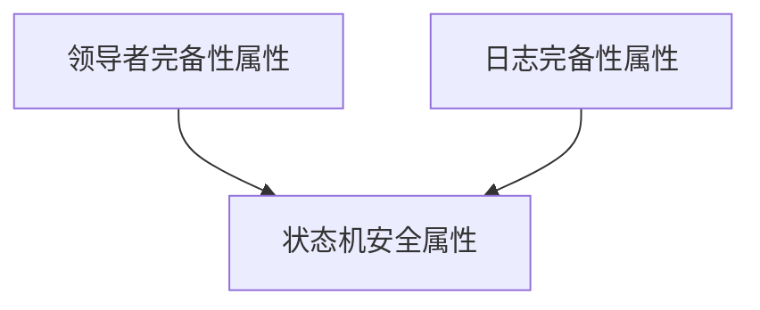

# Raft

[TOC]

## Safety

前面的章节描述了Raft如何选举领导者并复制日志条目。然而，迄今为止描述的机制并不足以确保每个状态机以相同的顺序执行完全相同的命令。例如，在领导者提交多个日志条目时，某个跟随者可能是unavailable(==这是因为即使leader已经commited了，依然无法保证全部已经更新该日志==)然后被选为领导者并用新的日志条目覆盖这些条目；结果,不同的状态机可能执行不同的命令序列。 

本节通过对可能选举为领导者的服务器进行限制来完成Raft算法。该限制确保任何给定任期的领导者都包含在之前任期中提交的所有条目（图3中的Leader Completeness Property）。

在给出选举限制后，我们进一步明确提交规则。最后，我们提供Leader Completeness Property的证明概述，并展示它如何导致复制状态机的正确行为。

#### 选举限制

在任何基于领导者的共识算法中，领导者最终必须存储所有已提交的日志条目。在一些共识算法中，例如Viewstamped Replication[22]，即使领导者最初不包含所有已提交的条目，也可以选举领导者。这些算法包含其他机制，用于识别缺失的条目并在选举过程中或之后不久将它们传输给新领导者。不幸的是，这导致了相当多的额外机制和复杂性。

Raft使用了一种更简单的方法，它==保证==每个新领导者从其选举时起都==具有来自之前任期的所有已提交条目==，无需将这些条目传输到领导者。这意味着日志条目仅在领导者和跟随者之间单向流动，而领导者永远不会覆盖其日志中的现有条目。

Raft使用投票过程来防止只有当日志包含所有已提交的条目时，候选者才能赢得选举。候选者必须联系到大多数集群才能当选，这意味着每个提交的条目必须存在于这些服务器中的至少一个中。如果候选者的日志与大多数投票者的日志至少同样**更新**（其中==“更新”==在下面被准确地定义），那么它将包含所有提交的条目。RequestVote RPC实现了这个限制：==RPC包括有关候选者日志的信息==，如果投票者自己的日志比候选者的日志更新，则投票者将拒绝其投票。

RequestVote RPC包含了候选者的term、候选者的id、候选者的最后一个日志条目的term和index等信息。具体来说：

1. term：候选者的当前任期号，用于让被请求者进行判断是否更新自己的任期号。
2. candidateId：请求选票的候选者的 ID。
3. **lastLogIndex**：候选者的最后一个日志条目的索引值。
4. **lastLogTerm**：候选者最后一个日志条目的任期号。

这些信息将被发送到集群中的其他节点，以请求它们的投票。收到RequestVote RPC的节点将会对请求进行一系列的判断，比如当前节点的任期号是否比候选者的任期号大、候选者的日志是否比当前节点更新等，然后再决定是否将票投给该候选者。

通过这种方式，Raft保证了只有具有更加完整和最新日志的节点才能够成为领导者。

Raft通过比较日志中最后一个条目的索引和任期来确定哪个日志更新。

1. 如果日志具有不同任期的最后条目，则具有较晚任期的日志更为更新。
2. 如果日志以相同的任期结束，则较长的日志更为更新。 

### 从之前的任期提交条目

 如第5.3节所述，当一条当前任期的条目存储在大多数服务器上时，领导者知道该条目**已提交**。如果领导者在提交条目之前崩溃，未来的领导者将尝试完成复制该条目。(**即从之前任期的日志继续工作**)

然而，领导者不能立即得出结
论，一条来自==之前任期==的条目一旦存储在大多数服务器上就被提交。(**但是，==当前任期==的条目存储在大多数服务器上时，领导者知道该条目已提交**)图8说明了一种情况，其中旧的日志条目存储在大多数服务器上，但仍然可以被未来的领导者覆盖。

*图8时间序列展示**为什么领导者不能使用来自旧任期的日志条目确定提交**。*

* a S1是领导者，部分复制了索引2处的日志条目。

* b S1崩溃,S5被S3、S4和它自己的投票选举为第3个任期的领导者，并接受了不同的索引2处的日志条目。
* c中，S5崩溃；S1重新启动，被选为领导者，并继续复制。此时，在大多数服务器上复制了第2个任期的日志条目，但尚未提交。
* 如果S1像（d）中那样崩溃，则S5可以被选为领导者（由S2、S3和S4投票），并==使用其自己的第3个任期的条目覆盖条目==
* 但是，如果S1在崩溃之前在大多数服务器上复制了当前任期的条目，如（e）中所示，则该条目已提交（S5无法赢得选举）。此时，日志中所有之前的条目也已提交。

为了消除类似图8中的问题，Raft永远不会通过来数副本的数量来确认**已提交**来自先前任期的日志条目。只有来自领导者当前任期的日志条目通过数副本的数量提交；

一旦以这种方式提交了来自当前任期的条目，那么所有先前的条目都会间接提交，因为**日志匹配属性**。

有些情况下，领导者可以安全地得出结论，旧的日志条目已提交（例如，如果该条目存储在每个服务器上），但是Raft为了简单起见采取了更保守的方法。 

Raft在提交规则中承担了这种额外的复杂性，因为当领导者从先前的任期复制条目时，日志条目保留其原始任期编号。在其他共识算法中，如果新领导者重新复制先前“任期”的条目，则必须使用其新的“任期编号”进行复制。

Raft的方法使得推理日志条目更容易，因为它们随时间和跨日志保持相同的任期编号。此外，Raft中的新领导者发送的来自先前任期的日志条目比其他算法中的更少（其他算法必须发送冗余的日志条目以重新编号，然后才能提交）。 

### 安全性论证

给定完整的Raft算法，我们现在可以更精确地证明==Leader Completeness Property==成立（此论证基于安全性证明；请参见第9.2节）。我们假设Leader Completeness Property不成立，然后证明矛盾。

==反证法==

假设任期T的领导者（leaderT）提交了来自其任期的日志条目，但某个未来任期的领导者（leaderU）没有存储该日志条目。考虑最小的任期U > T，其中的领导者（leaderU）没有存储该条目。

1. 已提交的条目在在leaderU当选时，已经不存在于其日志中（领导者永远不会删除或覆盖条目）。
2. leaderT在集群的大多数机器上复制了该条目，并且leaderU得到了集群的大多数投票。因此，至少有一台服务器（“投票者”）既接受了来自leaderT的条目，又投票给了leaderU，如图9所示。投票者对于达到矛盾是关键的。
3. 投票者在投票给leaderU之前必须从leaderT接受了提交的条目；否则，它会拒绝来自leaderT的AppendEntries请求（它的当前任期将高于T）。
4. 投票者在投票给leaderU时仍存储该条目，因为每个中间的领导者都包含该条目（按照假设），领导者永远不会删除条目，而跟随者仅在与领导者冲突时才会删除条目。
5. 投票者将其选票授予leaderU，因此leaderU的日志必须与投票者的日志一样最新。这导致了两种矛盾中的一种。
6. 首先，如果投票者和leaderU具有相同的最后一个日志任期，那么leaderU的日志必须至少与投票者的日志一样长，因此它的日志包含投票者日志中的每个条目。这是一个矛盾，因为投票者包含已提交的条目，而leaderU被假设不包含。
7. 否则，leaderU的最后一条日志任期必须大于选民的任期。此外，它也必须大于T，因为选民的最后一条日志任期至少是T（它包含了在任期T中被提交的日志项）。创建leaderU最后一条日志项的早期领导者必须已经在其日志中包含了已提交的日志项（这是一个假设）。然后，根据日志匹配属性，leaderU的日志也必须包含已提交的日志项，这是一个矛盾。
8. 这完成了矛盾。因此，所有大于T的任期的领导者都必须包含在任期T中被提交的所有日志项。
9. 日志匹配属性保证，未来的领导者也将包含间接提交的日志项，例如图8(d)中的索引2。

根据**领导者完备性属性**，我们可以证明图3中的状态机安全属性，该属性指出如果服务器已经将给定索引的日志条目应用到其状态机中，则任何其他服务器都不会为同一索引应用不同的日志条目。在服务器将日志条目应用于其状态机时，其日志必须与领导者的日志相同，直到该条目，并且该条目必须已提交。现在考虑任何服务器应用给定日志索引的最低任期。

**日志完备性属性**保证所有更高任期的领导者都将存储相同的日志条目，因此在后续任期中应用该索引的服务器将应用相同的值。因此，状态机安全属性成立。 最后，Raft要求服务器按照日志索引顺序应用条目。

结合状态机安全属性，这意味着所有服务器将按照相同的顺序应用完全相同的日志条目到其状态机中

## chatGPT

### raft是用于日志的复制，但这个前提是建立在每台机器都需要建立自己的日志，这个日志是操作系统级别的嘛？

 Raft是用于在分布式系统中实现共识的算法，它可以用于复制任何类型的状态机，而不仅仅是日志。在Raft中，每个节点都维护一个复制的状态机，该状态机接受客户端请求并在多个节点之间进行复制以保持一致性。因此，在Raft中确实需要每个节点都维护自己的日志。 这个日志是操作系统级别的还是应用程序级别的取决于实现。**在大多数情况下，Raft日志是在应用程序级别实现的，而不是在操作系统级别实现的**。Raft只是提供了一种机制来保证复制状态机的一致性，而具体的实现方式取决于使用Raft的应用程序的需求和设计。

### raft是能保证节点的指令流都一致还只是数据的一致？

在Raft中，每个节点维护一个复制的状态机，该状态机接受客户端请求并在多个节点之间进行复制以保持一致性。这包括复制客户端请求所产生的指令，因此Raft可以保证节点的指令流是一致的。

同时，Raft还可以保证节点之间的数据一致性。当一个节点的状态机被更新后，该节点会向其他节点发送更新信息，其他节点也会更新它们的状态机。在这个过程中，Raft会保证所有节点最终拥有相同的状态机，从而保证数据的一致性。

### 什么是共识算法？

共识算法是用于在分布式系统中协调多个节点达成一致性的算法。在分布式系统中，由于网络延迟、节点故障等因素的影响，节点之间可能出现不一致的情况。共识算法旨在通过一定的协议和机制，使得多个节点可以就某个值或某个决策达成一致。这个过程中需要保证协议的正确性、可靠性和高效性。

共识算法被广泛应用于分布式系统中，例如分布式数据库、分布式文件系统、区块链等场景。其中比较著名的共识算法包括Paxos、Raft、Zab等。这些算法具有不同的特点和适用场景，但它们的目标都是在分布式系统中实现一致性和可靠性。

### and it enforces a stronger degree of coherency to reduce the number of states that must be considered.这句话的意思是说该算法采取更强的一致性使得节点的状态变少嘛？

是的，这句话的意思是Raft算法采用了更强的一致性机制，以减少需要考虑的状态数量。具体来说，Raft将一致性机制分解为几个关键部分，如领导人选举、日志复制和安全等，通过明确定义每个部分的规则和机制，使得整个一致性机制更加清晰和易于理解。同时，Raft使用了一种称为"强一致性"的机制，可以保证每个节点在任何时刻都具有相同的视图和状态，从而减少需要考虑的状态数量，简化了算法的实现和理解。

### 比如说A，B无法建立起连接，正常来说，A节点可以认为是发生了网络故障或者是B fail了，但假如说A节点只认为是B节点fail了，那么这是不是就是上面所说的强一致性减少了需要考虑的状态？

不完全正确。在 Raft 中，强一致性确保所有节点始终具有相同的日志、视图和状态，这意味着在您的例子中，如果节点 A 认为节点 B 失败，那么这种失败会被广播给其他节点，并被所有节点视为 B 节点的故障。这样可以确保所有节点的视图和状态都是相同的，而不需要考虑不同节点对于失败的不同看法，因此可以减少需要考虑的状态数量。

需要注意的是，Raft 的强一致性只是保证了节点的状态和视图是相同的，但并不保证这些状态和视图是正确的。当发生网络分区或节点故障等情况时，可能会导致 Raft 算法中的节点状态和视图与实际情况不一致。因此，Raft 还需要其他机制来保证系统的正确性和健壮性，例如快照、选举超时等机制。

### 简单介绍Paxos

Paxos是一种著名的共识算法，它可以用来保证分布式系统中多个节点对某个值或决策达成一致。在一个分布式系统中，由于网络延迟、消息丢失等因素，节点之间可能会出现不一致的情况，而Paxos算法的目的就是解决这种不一致性问题。

Paxos算法由于其独特的思想和复杂的实现方式，被认为是分布式系统领域中最困难的算法之一。它包含了三个关键的角色：Proposer（提案者）、Acceptor（接受者）和Learner（学习者），并且涉及到多轮消息的交互。在这个算法中，Proposer向Acceptor发起一个提案，Acceptor可以选择接受或拒绝这个提案，最终如果有足够多的节点接受了这个提案，那么这个提案就会被Learner接受并成为共识的值。

虽然Paxos算法可以保证一致性，但是它的理解和实现都非常困难，因此在实际应用中并不常见。相对来说，近年来另一种共识算法Raft被广泛应用，并且相比于Paxos来说更容易理解和实现。

### Raft使用比其他共识算法更强的领导方式。例如，日志条目仅从领导者流向其他服务器。这简化了复制日志的管理，这其实就是在做强一致性？

Raft使用比其他共识算法更强的领导方式，这意味着它采用了强一致性的机制来管理复制日志。在Raft中，日志条目仅从领导者流向其他服务器，以确保日志的一致性和正确性。这种机制相对于其他算法简化了复制日志的管理，并减少了状态空间的大小，从而使Raft更易于理解。

### 一样的问题，这不会导致领导者的网络吞吐量嘛

这个问题涉及到领导者的网络负载和性能问题。在 Raft 中，领导者承担了复制日志等任务，因此会产生更多的网络流量。不过，Raft 在设计时考虑到了这一点，使用了一些技术来降低网络负载和提高性能，例如：

- 心跳机制：Raft 使用心跳机制来维护领导者和其他服务器之间的通信，以避免不必要的网络流量。
- 批量复制：Raft 采用批量复制的方式，将多个日志条目打包成一次网络传输，减少了网络传输的次数，从而降低了网络负载。
- 异步复制：Raft 允许领导者和跟随者之间的复制是异步的，这样可以减少网络延迟，提高复制性能。

因此，虽然领导者的网络负载确实会增加，但是 Raft 使用一些优化技术来降低这种负载，提高性能，从而保证了系统的可扩展性和可用性。

### raft 允许领导者和跟随者之间的复制是异步的 ，这句我不理解

Raft中，领导者和跟随者之间的日志复制是异步的，这意味着领导者可以在不等待所有跟随者确认日志已复制的情况下继续提交新的日志条目。具体来说，领导者将日志条目附加到其自己的日志中，并通过附加日志条目的方式向跟随者发送日志条目，跟随者接收到日志条目后将其附加到自己的日志中。由于网络延迟等原因，跟随者可能不能立即将日志条目复制到自己的日志中，但这并不会影响领导者继续提交新的日志条目。这种异步的复制方式可以提高系统的性能和吞吐量。

### 能否做这样的事情，比如让附近的跟随者复制日志到跟随者

在 Raft 中，日志只从领导者发送到跟随者，而不是从跟随者之间进行复制。因此，让附近的跟随者直接复制日志到其他跟随者是不可行的。必须通过领导者将日志复制到其他服务器。

### 但这样似乎会加快速度

是的，如果领导者和附近的跟随者之间的网络带宽比较高，那么允许这样的日志复制方式可以加速复制过程。但是，需要注意的是，这种异步的日志复制方式可能会导致节点之间的数据不一致，需要raft算法自身的机制来保证强一致性。此外，如果网络状况变差或者出现其他异常情况，这种异步复制方式可能会导致数据的丢失或不一致，因此需要权衡利弊，根据实际情况来选择合适的复制方式。

### 因此每台服务器都有共识模块，他们读取客户的请求，通过于其他服务器通讯保证之后以相同的顺序写入日志？

是的，每台服务器都有共识模块，它们接收来自客户端的请求并将其添加到其本地的日志中。为了保持复制日志的一致性，这些共识模块需要与其他服务器上的共识模块进行通信，以确保每个日志最终包含相同的请求，并且这些请求的顺序也是相同的，即使有些服务器宕机了。一旦命令被正确地复制，每个服务器上的状态机会按照日志顺序处理它们，并将输出返回给客户端。因此，所有这些服务器看起来就像一个高度可靠的单一状态机。

### if any server has applied a particular log entry to its state machine, then no other server may apply a different command for the same log index. 这是什么意思？

 这句话的意思是，如果任何一个服务器已经将特定的日志条目应用到其状态机中，那么其他服务器就不能对相同的日志索引应用不同的命令。换句话说，对于给定的日志索引，只能有一种命令在系统中被应用，确保所有服务器的状态机最终达到一致状态。这是 Raft 一致性算法的一个关键安全性质。

### 这点蛮有趣的，那么leader会先把日志条目应用到状态机中再发送日志到其他机器来保证自己的状态机的优先嘛？

是的，Raft中的leader会先将接收到的客户端日志条目应用到自己的状态机中，然后再将这些日志条目发送给follower，以便follower也能够将它们应用到自己的状态机中。这个过程被称为日志的复制(replication)。follower在收到leader的日志后，会将这些日志按照顺序应用到自己的状态机中。这样，每个服务器的状态机都会按照相同的顺序应用相同的日志条目，从而满足Raft的State Machine Safety Property。

### 在raft中，如果一个leader发现了一个term比自己高的leader，就会？

立即放弃自己的领导者身份，变成follower状态。这是因为在Raft算法中，一个更高的term意味着有一个新的leader被选举出来，而且只有一个leader能够对日志进行操作，以避免数据不一致的问题。如果一个follower仍然认为自己是leader，那么可能会导致多个leader同时操作日志，造成数据不一致的情况。因此，当一个leader发现自己的term比其他server的term小或者过时时，就会立即放弃自己的leader身份，变成follower状态。

### 为什么要把时间分成随机长度的term

### 选举将导致**分裂投票**。在这种情况下，term将以没有leader的状态结束，那么在下一次选举之前，依然使用之前的leader?

### 在raft这篇paper中，The leader keeps track of the highest index it knows to be committed, and it includes that index in future AppendEntries RPCs (including heartbeats) so that the other servers eventually find out是什么意思？

在Raft论文中，这句话的意思是，领导者会记录已提交的最高索引，并在将来的AppendEntries RPC（包括心跳）中包含该索引，以便其他服务器最终得知该信息。通过在心跳消息中包含已提交的最高索引，领导者可以让跟随者知道自己的提交进度，并帮助它们进行日志复制。如果一个跟随者的日志在某个位置缺失了一个已提交的条目，它可以向领导者请求缺失的条目，以便将自己的日志复制到与领导者相同的状态。

###  如果不同日志中的两个条目具有相同的索引和任期，则它们存储相同的命令。 • 如果不同日志中的两个条目具有相同的索引和任期，则在所有先前的条目中，这些日志都是相同的。 这似乎的和计算机网络里的TCP连接里面只要保证分组里的某个组已经收到，就可以保证前面的分组已经收到很像？

确实，Raft中的这两个属性确保了分布式系统中的一致性，类似于TCP中确保数据可靠传输的方式。如果不同日志中的两个条目具有相同的索引和任期，则它们存储相同的命令，这类似于TCP中的数据重传机制，以确保数据的正确性。如果不同日志中的两个条目具有相同的索引和任期，则在所有先前的条目中，这些日志都是相同的，这类似于TCP中的确认机制，以确保分组的正确性和顺序性。Raft的这些属性确保了分布式系统中的日志复制机制，从而保证了分布式系统的正确性和一致性。

### 复习CP中的数据重传机制？

CP (Controlled-Pressure)是一种流量控制协议，它是基于TCP协议实现的。与TCP类似，CP也具有数据重传机制来确保数据的可靠传输。CP中的数据重传机制包括以下几个方面：

1. 超时重传：当发送方发送数据后，如果在一定时间内没有收到确认信息，则发送方会认为数据丢失，于是会重新发送数据。发送方会根据一定的超时算法来计算超时时间，以确保重传的时机合适。
2. 快速重传：当发送方连续发送相同的数据时，如果发送方收到三个重复的确认信息，则发送方会认为这些确认信息中间的数据已经丢失，于是会立即重传这些数据，而不是等待超时时间到达后再重传。
3. 滑动窗口：发送方和接收方会维护一个滑动窗口，用来控制数据的发送和接收。发送方会在滑动窗口内发送数据，并等待接收方的确认信息，只有在接收到确认信息后才能发送下一个数据。接收方会根据滑动窗口的大小来控制数据的接收，只有在滑动窗口内的数据才能被接收，否则会被丢弃。

通过这些机制的组合，CP协议能够在不可靠的网络环境下，保证数据的可靠传输

### 这怎么会类似raft中如果不同日志中的两个条目具有相同的索引和任期，则它们存储相同的命令?

确实，raft中的这个特性和CP协议中的数据重传机制并没有太大的关联。这个特性是raft协议中保证日志一致性的关键，通过保证任期和索引相同的两个条目存储的命令也相同，以及在这些条目之前的所有条目都相同，来确保各个服务器上的日志是一致的。这样可以避免由于服务器崩溃或网络故障等原因导致的日志不一致性问题。

而CP协议中的数据重传机制是为了保证数据在网络中的可靠传输，通过多次尝试重传数据来确保数据能够被成功接收。这两个机制的目的和作用是不同的，虽然它们都与保证系统可靠性有关。

### 所以其实Raft中的日志匹配机制是它尽最大努力去实现的，但是事实上在某个时间，这并不一定能实现?

是的，Raft中的日志匹配机制尽最大努力去实现一致性，但在某些情况下可能无法实现。例如，当存在多个领导者时，可能会出现冲突的日志条目，导致一致性无法保持。此外，如果发生了网络分区或服务器故障，可能会导致日志条目丢失或不一致。在这些情况下，Raft会尝试尽可能地恢复一致性，但无法保证一定成功。因此，Raft只能保证尽可能地保持一致性，而不是绝对保证一致性。

### 会要求跟随者检查它们在相同的索引和任期下是否与领导者的日志一致是把之前的日志全部检查一遍嘛?

不是的，Raft协议中的日志匹配检查是按顺序进行的。在发送AppendEntries RPC时，领导者会将新日志条目之前的最后一个日志条目的索引和任期发送给跟随者，跟随者会根据这个索引找到自己的日志中的相应条目进行比较。如果这个条目匹配，说明之前的所有条目也必须匹配，因为日志的顺序是确定的，不能出现领导者和跟随者的日志顺序不同的情况。因此，只需要检查新条目之前的最后一个条目即可保证整个日志匹配。

### 为了消除类似图8中的问题，Raft永远不会通过来数副本的数量来确认**已提交**来自先前任期的日志条目。只有来自领导者当前任期的日志条目通过数副本的数量提交； 一旦以这种方式提交了来自当前任期的条目，那么所有先前的条目都会间接提交，因为**日志匹配属性**。 有些情况下，领导者可以安全地得出结论，旧的日志条目已提交（例如，如果该条目存储在每个服务器上），但是Raft为了简单起见采取了更保守的方法。 这是为什么？

Raft协议采取更保守的方法来消除类似图8中的问题是因为在分布式系统中，节点之间的通信可能会出现延迟、丢包、网络分区等问题，这可能会导致节点之间的数据不一致。

如果Raft协议通过来数副本的数量来确认已提交来自先前任期的日志条目，而不是只确认来自领导者当前任期的日志条目，那么在网络分区的情况下，可能会出现不同的领导者和副本之间的日志不一致的情况。这会导致出现多个领导者、日志丢失、数据冲突等问题，进一步导致系统的不可用性和数据损坏。

因此，为了保证系统的一致性和可用性，Raft协议采取更保守的方式，只有来自当前任期的日志条目通过数副本的数量提交，这样可以确保只有当前的领导者的日志被提交，从而消除了日志不一致的可能性。这种方式虽然可能会导致一些旧的日志条目需要等待更长的时间才能被提交，但可以保证系统的正确性和稳定性。

### 那么之前的任期？

在之前的任期内，如果一个领导者被选举出来，但它的日志条目没有被完全复制到大多数节点上，那么当一个新的领导者被选举时，它将无法确认之前任期的日志条目是否已经提交。

为了避免这种情况，Raft协议采用了日志匹配属性的机制。具体来说，当一个新的领导者被选举时，它会向所有副本发送一个心跳消息，以便让副本将它的日志条目与自己的日志进行匹配。如果副本发现自己缺少某些日志条目，则会向领导者请求这些缺失的日志条目。只有在新的领导者确认大多数节点都复制了它的日志之后，它才会提交新的日志条目。

这个机制可以保证新的领导者只提交来自当前任期的日志条目，并且在提交新的日志条目之前，它会等待旧的日志条目被复制到大多数节点上。这样可以确保系统的正确性

### 到底什么是commited的？如果新任期无法提交之前的日志，那么之前任期未提交的日志就不管了嘛？

在Raft协议中，一个日志条目只有在满足以下两个条件时才会被视为已提交（committed）：

1. 该条目已经被领导者复制到大多数节点上；
2. 该条目所在的任期已经结束。

当一个日志条目被提交后，它就可以被应用到状态机上，以执行一些具体的操作，从而实现状态机的状态转换。在Raft协议中，只有已提交的日志条目才能够对状态机产生影响。

对于新任期无法提交之前的日志，Raft协议会采取一些特殊的处理方式。当新的领导者被选举时，它会通过发送心跳消息来与其他节点进行通信，以便让其他节点将它的日志条目与自己的日志进行匹配。如果其他节点发现自己缺失一些日志条目，则会向新领导者请求这些缺失的日志条目。

当新的领导者确认大多数节点都复制了它的日志条目之后，它就可以开始提交新的日志条目。在这个过程中，如果之前任期中的某些日志条目没有被提交，它们就会一直等待，直到它们满足提交条件为止。

因此，之前任期未提交的日志并不会被忽略，它们仍然可以在新任期中被提交。Raft协议通过日志匹配属性的机制来保证新领导者只提交来自当前任期的日志条目，并且在提交新的日志条目之前，它会等待旧的日志条目被复制到大多数节点上，从而确保系统的正确性和稳定性。

### 每次选举超时都会进入新的term？

是的，在Raft中，当一个follower没有收到leader的心跳或者其他candidate的投票请求时，它会等待一个随机的选举超时时间。如果在这个时间内没有接收到有效的消息，follower就会成为一个candidate并开始一次新的选举，这也就意味着进入了一个新的term。这个新的term的term号会比之前的term号大1，并且candidate会给自己投一票。

### 在复现raft的工作中，我是否可以设置一个阈值，比如当百分之八十的跟随者都已经复制了某个日志条目，那么领导者就认为该条目已经提交，并将该机器应用于状态机

在 Raft 中，提交规则是基于当前任期的。只有来自当前任期的日志条目通过足够多的副本提交后才会被提交，而不是基于跟随者的数量。因此，只有当领导者成功地将来自当前任期的日志条目复制到大多数副本上，并通过了提交规则后，才能将该日志条目应用于状态机。

您可以在代码中设置一个阈值来表示大多数，以便领导者知道需要多少个跟随者批准一个日志条目的提交。这个值通常设置为集群节点数量的一半加一，以确保领导者能够在至少一半的节点上复制日志条目，从而实现高可用性。但是，这个阈值不应该用来决定何时提交日志条目，而是用于决定何时可以开始提交日志条目，因为只有当大多数副本上都有相同的日志条目时，才能保证副本状态的一致性。

### 是的，当当前任期的日志条目被复制到超过这个阈值的跟随者时，领导者开始提交该条目，即应用到状态机上？

是的，您可以设置一个阈值来决定什么时候领导者可以提交当前任期的日志条目。在Raft协议中，这个阈值被称为“多数派原则”，通常是大多数服务器（即n/2+1）同意并复制了该日志条目后才提交。这样可以确保在出现网络分区或机器故障等问题时，只有拥有多数机器的服务器才会提交该条目，并最终达成一致。这也是Raft协议保证一致性和可靠性的关键机制之一。

### lastLogIndex和lastLogTerm都是来进行选举限制的?

是的，lastLogIndex和lastLogTerm两个参数都是用来进行选举限制的。在Raft中，当候选者发送RequestVote请求给其他节点时，请求中会包含候选者最新的日志条目的索引和任期号，也就是lastLogIndex和lastLogTerm。然后其他节点会比较这些参数与自己的日志是否一致，以决定是否投票给该候选者。

具体来说，如果其他节点的日志中最后一条日志的任期号比候选者的lastLogTerm小，那么就不会投票给该候选者。如果最后一条日志的任期号和候选者的lastLogTerm相等，那么就会比较最后一条日志的索引号，如果候选者的lastLogIndex比自己的索引号小，那么就不会投票给该候选者，否则就会投票给该候选者。通过这种方式，Raft保证了只有具有更加完整和最新日志的节点才能够成为领导者。

### 光是这样就可以保证已提交的日志条目会出现在新领导者的日志里吗?

不完全是的。如果新的领导者缺失先前任期的已提交日志条目，那么它可能无法将这些日志条目应用于状态机，从而导致状态机不一致。为了解决这个问题，Raft协议需要使用一个叫做“日志快照”的机制。

日志快照是指将状态机快照和一部分已提交的日志一起保存的一种机制。当一个跟随者的日志过于庞大时，领导者可以向该跟随者发送一份最新的日志快照。跟随者接收到日志快照后，就可以丢弃掉它之前的所有日志条目，只保留日志快照中包含的最后一条已提交的日志条目。然后，它可以向领导者请求缺失的日志条目，从而使得它的日志和领导者的日志保持一致。

在这种情况下，领导者需要记录已经发送给每个跟随者的日志快照的索引，以便在跟随者请求缺失的日志条目时，领导者可以快速判断是否需要重新发送日志快照。

### 啥意思，这和领导者被提交的日志条目有啥关系?

在Raft中，当领导者被提交的日志条目无法在新的领导者中被找到时，就需要使用日志快照来解决这个问题。领导者提交的日志条目在被应用到状态机后，会从日志中删除，而日志中剩余的未被提交的日志条目可能会很多。如果新的领导者的日志只包含已经被提交的日志条目，那么它们可能需要复制很多未提交的日志条目才能达到与之前的领导者相同的状态。这会增加复制的开销和时间。

因此，Raft使用日志快照来解决这个问题。日志快照是状态机当前的状态以及与其相应的日志条目的快照，当新的领导者需要从旧的领导者中复制大量日志条目时，可以使用日志快照来避免这个问题。具体来说，当新的领导者在进行日志复制时，如果发现它的日志中缺失了之前已提交的日志条目，那么它会向旧的领导者请求一个日志快照，并通过快照来恢复之前的状态。这样可以避免复制大量的日志条目，提高系统的效率。

### 新领导者是AppendEntries RPC的返回值知道跟随者存在被提交但自己不存在的日志条目？

是的，新的领导者可以通过检查响应中的成功索引来确定跟随者存在的最后一个匹配条目，以及领导者缺少的下一个条目。领导者可以使用这些信息来更新它自己的日志。如果领导者发现它自己缺少某些先前的已提交条目，它可以向跟随者请求日志快照，以便从中重建缺失的部分。

### 整理raft中1 Election Safety: at most one leader can be elected in a given term. §5.2 2，Leader Append-Only: a leader never overwrites or deletes entries in its log; it only appends new entries. §5.3 3.Log Matching: if two logs contain an entry with the same index and term, then the logs are identical in all entries up through the given index. §5.3 4.Leader Completeness: if a log entry is committed in a given term, then that entry will be present in the logs of the leaders for all higher-numbered terms. §5.4 5.State Machine Safety:  这五个属性的相互关系？

这五个属性相互保证了Raft协议的正确性和安全性。

1. 选举安全性：在一个给定的任期中，最多只能选出一个领导者。这保证了不会有多个领导者同时处理同一个任务，从而避免了数据的冲突和错误。
2. 领导者只追加日志：领导者只能向自己的日志追加新的日志条目，而不能覆盖或删除已经存在的条目。这保证了领导者的日志是有序的、不可变的，且每个条目的内容都是唯一的。
3. 日志匹配性：如果两个日志中存在相同索引和任期的条目，那么这些条目以及之前的所有条目都是相同的。这保证了领导者和跟随者的日志保持一致，从而避免了数据的不一致和错误。
4. 领导者完备性：如果某个任期中的一个日志条目被提交，那么该条目将存在于所有更高任期的领导者的日志中。这保证了已经提交的日志条目不会丢失或被忽略。
5. 状态机安全性：如果某个日志条目被提交，那么该条目将被应用到所有状态机中。这保证了状态机的正确性和一致性，从而避免了数据的错误和不一致。

### 这5个属性分别是由什么保证的？

1. Election Safety: 这个属性是由Raft协议中的投票机制保证的，只有在选举过程中满足特定条件的候选人才能成为领导者。
2. Leader Append-Only: 这个属性是由Raft协议中的领导者复制日志的规则保证的，领导者只能追加新的日志，不能修改已有的日志。
3. Log Matching: 这个属性是由Raft协议中的日志复制机制保证的，当两个日志中存在相同索引和任期的条目时，两个日志之前的所有条目都是相同的。
4. Leader Completeness: 这个属性是由Raft协议中的日志复制机制保证的，一旦一个条目被提交，该条目将会存在于所有更高任期的领导者的日志中。
5. State Machine Safety: 这个属性是由Raft协议中的状态机的顺序执行机制保证的，所有正确的节点最终都将执行相同的命令序列，从而得到相同的状态。

### 你说的不完整，比如Log Matching是由Leader Append-Only和AppendEntries执行的简单一致性检查共同保证的？

您是正确的，我的回答确实有些不完整。这五个属性相互关联，而不是彼此独立，实际上每个属性都是由其他属性的一些组合保证的。更完整的关系如下：

1. Election Safety: 由投票规则保证，确保在任期内最多只有一个领导者被选出。
2. Leader Append-Only: 由领导者对日志条目的操作规则保证，即只追加不删除或覆盖，以及对跟随者的AppendEntries RPC规则保证。
3. Log Matching: 由Leader Append-Only和AppendEntries RPC执行的简单一致性检查共同保证。
4. Leader Completeness: 由领导者和跟随者的Commit和AppendEntries RPC的规则共同保证，以确保已提交的日志条目最终会出现在所有领导者的日志中。
5. State Machine Safety: 由跟随者对已提交日志条目应用到状态机的规则保证，确保状态机只执行正确的操作。

需要注意的是，这只是一个粗略的总结，并不包括所有细节。每个属性都涉及到具体的规则和算法，需要进行深入的了解才能真正理解它们之间的相互关系。

